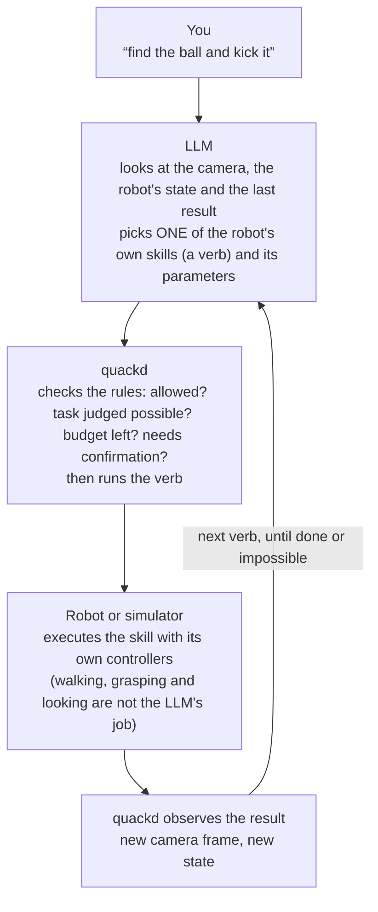
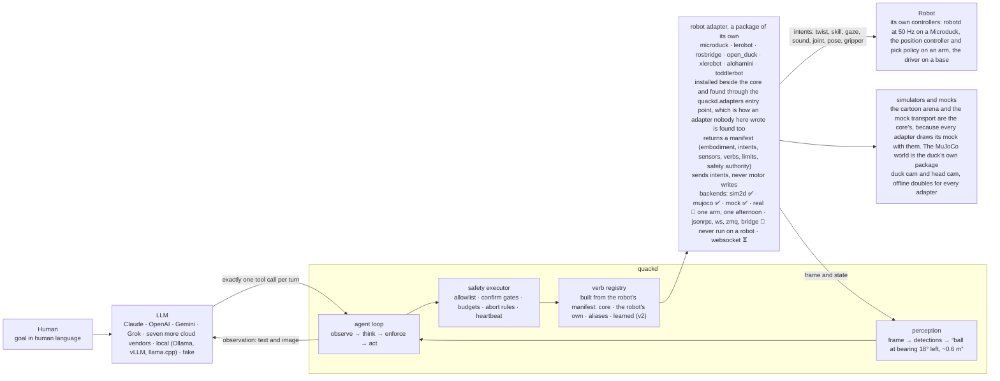

<p align="center">
  
</p>

<h1 align="center">quackd</h1>

<p align="center"><strong>One CLI for all your robots. Connect them, command them, and let them work together, each with an LLM for a brain.</strong><br>
<sub>quackd, pronounced “quacked”, began as the brain daemon the Microduck was missing, named like that robot's own <code>robotd</code>, <code>mediad</code>, <code>padd</code> and <code>tofd</code>. That is where the ducks come from: a task is a <code>.duck</code> file and a group of robots is a flock. Seven robots today, one of them driven on real hardware and the other six still in a simulator or a mock, and one of them a duck you can print and build yourself.</sub></p>

<p align="center">Register each robot once, by name. Then state a goal from a terminal or from a chat with Claude, to one robot or to a flock of them, and the same contract decides which of each robot's skills its model may use, how many steps it gets, and when it has to ask you first.</p>

<p align="center">
  <a href="https://github.com/rokbenko/quackd/actions/workflows/ci.yml"></a>
  <a href="https://pypi.org/project/quackd/"></a>
  <a href="https://pypi.org/project/quackd/"></a>
  <a href="LICENSE"></a>
  <a href="docs/mcp.md"></a>
  <a href="docs/adapter-status.md"></a>
</p>

<details>
<summary>Hey, my name is Rok and this is why I built quackd 👋</summary>

> I see quackd as a ChatGPT like moment for robotics. Let me explain what I mean.
>
> LLMs existed long before ChatGPT. What ChatGPT actually did was take LLMs and hand them to ordinary people in a chat interface everyone already knew, like Facebook Messenger or Instagram. That was the real unlock.
>
> Right now, in 2026, most people still think robots belong in science fiction movies or in a lab at Tesla. That is not true anymore. There are already open source robots you can build yourself for under $1000. And they actually work. They can go to your fridge, open it, grab a can of Coke, close the fridge and bring it to you.
>
> The problem is they have a huge limitation. You can teach them dozens of moves, like "get a coke". But the robot itself is still dumb. It knows the moves, it just cannot connect them on its own. For robots to become truly useful, they need to become AI first and agentic. You give them a goal and they figure out the steps themselves.
>
> To get there, robots need a brain. And here is the catch. Today's robots simply do not have enough hardware on board to think, reason and plan. Their skull is too small for the brain this kind of intelligence needs. So the brain has to live outside the robot, in the cloud or on your own computer, where it can grow as big as you need. The robot itself stays small and light while all the heavy thinking happens somewhere else. That is what quackd started as. A brain for one robot.
>
> But here is what I think comes next. In the future everyone will have a flock of robots. At home, in the office, wherever. And they will not all be the same robot. Different types, different capabilities, even different companies. The first challenge is having all of them in ONE place to command. That is what quackd is now. You connect every robot you own to one CLI, and you command all of them from there, with an LLM as the brain of each one.
>
> But even when you have them all in one place, that is still not enough. What you ask for will be complex, and robots will probably be very specialized. One can walk, one can grab, one can carry. For a bunch of different robots to be useful with as little of your involvement as possible, they need to start working together towards the goals you give them. Which means they need to communicate between each other. So that is the other half of quackd. You give the flock a goal, each robot's brain reads what the others can do, and they divide the work between themselves.
>
> Imagine telling your robots "I want to eat and drink something". The one with wheels goes to the fridge, checks what is inside and tells the others what it found. The one with arms grabs a plate and some cutlery. One of them brings it all to you and asks what you would like, you choose, and they go back for the food and wish you a good meal. Sounds like science fiction, right? We are closer than you think!
>
> That is basically what ChatGPT did for LLMs. It took something powerful and put it in one place everyone could reach. And that is why I see quackd as a ChatGPT like moment for robotics.
>
> — Rok Benko, September 2026

</details>

<p align="center">
  
  <br>
  <sub><strong>A real arm, a real model, one sentence.</strong> An SO-101 follower arm on 2026-09-15, piloted by OpenAI's <code>gpt-6-astra</code> through <code>quackd run --goal "Wave to the camera with an extended arm"</code>. The model was handed the arm's five verbs and its datasheet and chose one call at a time: raise the shoulder and elbow, roll the wrist four times, return, stop. Nobody wrote a wave. The whole run at ten times speed, filmed on a phone: it opens on the command going into a terminal, watches the run scroll, then pans to the bench, and the wave itself is the part where the wrist rocks. What the model was told, all ten of its calls and what went wrong are in <a href="#what-happened-in-that-run">What happened in that run</a>, and how every recording here was made is in <a href="docs/assets/README.md">docs/assets</a>.</sub>
</p>

**quackd** is a command line for the robots you own. Each one joins through an adapter that declares, as a manifest, what the body is and what it can do, and you register it once by name with how to reach it. Give a robot a goal like *"find the ball and kick it"* and a large language model picks one skill at a time from the list that manifest declares, quackd runs it, looks at the camera, and asks again until the job is done or clearly impossible. Give the same goal to a flock and every robot in it gets a model of its own, and they divide the work by telling each other what they are going to do. A goal can arrive from a chat, a command line or a `.duck` task file, and whichever way it comes, quackd enforces a contract the model cannot talk its way out of: which skills are allowed, how many steps, when a human must say yes, when to abort. Claude, OpenAI, Gemini, Grok, Mistral, DeepSeek, Cohere, Qwen, Kimi, GLM and Meta work over their APIs. Open source models work on your own machine through Ollama, vLLM, llama.cpp or LM Studio, with no key. A model is the pilot on every run. `--decision-llm` optionally puts something in front of it that is **not** a language model and cannot be used as one: a decision LLM generates no text at all, it scores a fixed set of options against a state and returns which one with a probability for each, so it answers the turns that are a choice among calls the robot already has and can no more write a joint angle than a thermometer can. TypeSafe's Jev was the first of them and is the hosted one, and the others quackd names are open servers you run yourself or a checkpoint loaded into this process, each with a page of its own. Off unless you name one, and `--decision-mode shadow` records what one would have chosen without letting it change a thing ([docs/decision-llms.md](docs/decision-llms.md)).

The first robot is the [Microduck](https://pollen-robotics.com/microduck/) from Pollen Robotics: a 25 cm, 800 g biped with fifteen small servos, a camera in its head, a depth sensor, a speaker and an onboard computer, open source and about $399, which already knows how to walk, turn, kick, scoop something off the floor, look around and quack at 50 Hz on its own hardware. It is the robot quackd started on, independently and unofficially. Six more bodies follow it through adapters that declare what each can do: an [Open Duck Mini v2](https://github.com/apirrone/Open_Duck_Mini) you can print and build yourself, an SO-101 class arm through LeRobot, any wheeled base over rosbridge, an XLeRobot dual-arm cart, an AlohaMini with two arms on a lift, and a ToddlerBot humanoid.

**One of the seven bodies runs on real hardware, and the recording above is it.** On 2026-09-15 an SO-101 follower arm ran quackd over `lerobot:real` through twelve `--goal` runs in one afternoon, piloted by OpenAI's `gpt-6-astra` from a Windows laptop with a USB webcam: it waved with its wrist, reached out with its shoulder and elbow, opened and closed its gripper, and once mimed a duck quacking with it. The GIF is the last of the twelve, and [What happened in that run](#what-happened-in-that-run) reads its transcript call by call. The honest half is there too. The arm fell at the end of every one of those runs, because LeRobot drops torque when it disconnects, which is what [the rest pose](#your-robots-by-name) was written afterwards to stop, and the camera framed the gripper and cropped the raised arm, so the model checked its own waves against joint readings rather than against the picture. The other six bodies have not met hardware. Their real backends speak names read from upstream source at a pinned commit and have only ever talked to fakes, and for the Open Duck Mini and the ToddlerBot those fakes are the daemons quackd itself ships for the robot, exercised over loopback, so there only the body is untested. No flock has yet crossed from one machine to a second. Goals like *"find my keys"*, handed to a flock that sorts out who does what, are where this is going, not what it does yet. The honest label for today is *LLM driven, goal directed control of one real arm and six simulated or mocked bodies, alone or in flocks*, and [Which robots work](#which-robots-work) says exactly how far each one has got.

**No robot yet? You do not need one to try it.** Two simulators, and they come from different places. The **cartoon** is the core's own arena, which is why the three other bodies that have a simulator use it too, along with every seeded sweep in CI: it starts in a second and downloads nothing, and `quackd[microduck]` is what gives it a duck to put in it. The **physics** one is `quackd[mujoco]`, which puts the real Microduck in [MuJoCo](https://github.com/google-deepmind/mujoco) and runs the walking policy Pollen trained for it, so the duck walks instead of sliding and a command below its gait floor produces nothing at all. These goals succeed on 10 of 10 seeds with the scripted pilot and a ground truth check:

> **"Find the ball and kick it."** · **"Find the ball, walk up to it and say where it is."** *(an Open Duck Mini v2, which cannot kick)* · **"Split the search, the closest duck kicks."** *(a flock)*

The first of those has passed 10 of 10 on the physics simulator too, with the duck on its own gait rather than a sprite on rails, though not on every run: that is `test_find_and_kick_on_the_real_duck`, which needs upstream's model in the cache, so a nightly job fetches it the way your first run would and CI's own gating job runs the stand-in. The Status section below says what that sweep actually returns. The rest are cartoon only, because the other six bodies have no physics model here.

<br>

## Table of Contents

- [Quickstart: a LeRobot SO-101 arm](#quickstart-a-lerobot-so-101-arm)
  * [From the terminal](#from-the-terminal)
  * [From Claude, over MCP](#from-claude-over-mcp)
  * [What happened in that run](#what-happened-in-that-run)
- [No robot yet? Try it in 60 seconds](#no-robot-yet-try-it-in-60-seconds)
- [Why?](#why)
- [How it works (the simple version)](#how-it-works-the-simple-version)
- [Example](#example)
- [Status](#status)
- [Which robots work](#which-robots-work)
- [Architecture](#architecture)
- [Installation](#installation)
- [Usage](#usage)
  * [Your robots, by name](#your-robots-by-name)
  * [The `.duck` file](#the-duck-file)
  * [Pilot it from Claude (MCP)](#pilot-it-from-claude-mcp)
  * [What it remembers](#what-it-remembers)
- [Connect any robot](#connect-any-robot)
- [Flock mode](#flock-mode)
- [The browser demo](#the-browser-demo)
- [Configuration](#configuration)
- [Performance](#performance)
- [Limitations](#limitations)
- [Roadmap](#roadmap)
- [Contributing](#contributing)
- [Safety](#safety)
- [Acknowledgements](#acknowledgements)
- [Star history](#star-history)
- [License](#license)

<br>

## Quickstart: a LeRobot SO-101 arm

Two ways to drive the same arm, and the steps that set the arm up are shared between them. **[From the terminal](#from-the-terminal)** is the path the recording at the top of this page took, in ten steps, with the arm calibrated, named and parked before anything you type can move it. **[From Claude, over MCP](#from-claude-over-mcp)** is the same arm reached from a chat instead, where the model you are already talking to is the pilot. Either way you need the arm and its serial port, a USB webcam, and Python 3.12 or newer, because LeRobot itself needs it. Only the terminal path needs a key for one cloud vendor, because only that one brings a model of its own.

### From the terminal

1. **Install the arm and a pilot into one environment.** Below Python 3.12 the `lerobot` extra resolves to nothing while the install still reports success, so pin the interpreter.

    ```bash
    uv venv --python 3.12
    uv pip install "quackd[lerobot,openai]"     # or anthropic, gemini, grok, and so on
    ```

2. **Put the key where quackd reads it.** One line in a `.env` file, in the folder you run from or in the venv root: `OPENAI_API_KEY=sk-...`. `quackd doctor` prints the key it found for each provider, masked to its ends, which is the quickest way to see that the file was read at all.

3. **Find the port, then calibrate under the name you will register.** Calibration is LeRobot's own tool and it asks you to move each joint through its range by hand. quackd reads every joint limit out of the file it writes, and refuses an arm that has none.

    ```bash
    lerobot-find-port
    lerobot-calibrate --robot.type=so101_follower --robot.port=COM3 --robot.id=arm-01
    ```

4. **First contact, which moves nothing.** Connect, read the joints, temperatures and torque back, disconnect. Support the arm while it starts, because connecting releases torque for a moment.

    ```bash
    quackd doctor --robot lerobot:real --address COM3
    ```

5. **Name it.** The registry keeps the port, the camera and the pilot under one name, so every command after this is `--robot arm-01`. Register it under the id you calibrated as.

    ```bash
    quackd robot add arm-01 lerobot:real --address COM3 --llm openai:gpt-6-astra
    ```

6. **Fold the arm by hand, then record where it rests.** An SO-101 has no brake and LeRobot releases torque when it disconnects, so without this the arm drops from wherever the run left it. With it, every run starts at this pose and returns to it before quackd lets go. This pose is where every run starts and ends unless the run itself says otherwise, and the one flag that says otherwise is just below step 10, where it changes the start and leaves the end alone.

    ```bash
    quackd robot rest-pose arm-01
    ```

7. **The first task moves nothing either.** `lerobot-lookout` allows `report_state` and `stop` and nothing else: it reads the arm and says what it found. There is nothing to improvise, so the scripted pilot is enough and this costs no tokens.

    ```bash
    quackd run lerobot-lookout --robot arm-01 --llm fake
    ```

8. **Add the webcam.** `lerobot-find-cameras opencv` prints the indices and saves a frame from each, so you can see which is which. Point it at the space the arm moves through rather than at the gripper, which is the mistake the run above made.

    ```bash
    quackd robot edit arm-01 --camera-url "opencv://2"
    ```

9. **Rehearse it.** With `--dry-run` the arm is connected and read, and not one command reaches it, so you see which verbs the model reaches for and with what numbers before a joint moves.

    ```bash
    quackd run --goal "Wave to the camera with an extended arm" --robot arm-01 --max-steps 10 --dry-run
    ```

10. **Then let it move.** A hand near the power switch, the arm's whole sweep clear, and the same sentence without the flag. This run starts at the rest pose you recorded in step 6 and folds back to it when it is over, which is the default and the first of the two choices below rather than the only way a run can begin.

    ```bash
    quackd run --goal "Wave to the camera with an extended arm" --robot arm-01 --max-steps 10
    ```

**Or start from a pose you set by hand.** `--by-hand` gives you the arm before the pilot gets it. The arm is driven to the rest pose from step 6 first, torque comes off there, and quackd waits: lift the arm, put whatever the task needs into the gripper, close the gripper on it, hold the arm where the run should begin, and press Enter. quackd writes the pose you left as the goal, puts torque back on, reads the joints again to check nothing sagged, and prints the angles it is now holding so you know you can let go. The pilot works from there. At the other end the arm is still holding whatever it ended on, so it is handed back to you before anything opens: take hold of what is in the gripper and press Enter, the gripper opens, and only then does the arm fold back to the rest pose. Leave it alone and it folds up with the gripper still shut. This needs the rest pose from step 6, because the rest pose is the one place quackd will drop torque and an arm released anywhere else falls, and it needs a terminal, because somebody has to press Enter.

```bash
quackd run --goal "draw a circle on the paper in front of you" --robot arm-01 --by-hand
```

**Give it a picture.** `--image` hands a file to the task itself, which is not the same thing as what the robot can see. The pilot gets each picture on its first turn, labelled with the file's own name, and keeps it in front of it for the whole run. That is what makes it different from a camera frame: a frame is perception, it arrives again every step and it shows the room as it is now, while a task picture never changes and is what the task is about. The flag repeats, so a run can carry several. It needs a pilot that takes images, `quackd list-models` marks the models that take no frames, and a local model needs `--vision`.

```bash
quackd run --goal "draw what is in the picture" --robot arm-01 --image sketch.png
```

**Or put a stepper in front of the model.** `--decision-llm` is optional, off unless you name one, and needs no change to any of the ten steps above. With `--decision-mode shadow` a run is exactly the run it would have been, and the transcript also records what the decision LLM would have chosen on each turn, which is how you find out whether it is worth switching on for your bench. With `--decision-mode on` it answers the turns whose answer is a choice among calls the arm already has, and every joint angle is still the model's. `jev` is TypeSafe's hosted one and wants `quackd[decision]` and `TYPESAFE_API_KEY` ([docs/decision-llms/jev.md](docs/decision-llms/jev.md)), and every other name quackd knows, what it wants and where it runs, is one table in [docs/decision-llms.md](docs/decision-llms.md), a page each.

```bash
quackd run arm-grip-check --robot arm-01 --by-hand --decision-llm jev --decision-mode shadow
```

Put the two together and you have the drawing case: you set the arm down holding a pen where the paper is, and the model is looking at the sketch it has to copy.

```bash
quackd run --goal "draw what is in the picture" --robot arm-01 --image sketch.png --by-hand
```

**Two of those steps were not taken in the recording.** The run in the GIF was reached as `--robot lerobot:real --address COM3`, with no registered name and no rest pose. Step 5 existed that day and simply was not used, so the registry has still never been pointed at hardware. Step 6 did not exist at all: the rest pose was written after that afternoon, in answer to it, and has been exercised against `lerobot:mock` and in the test suite and not yet on a real arm. The arm in the recording is held up by torque alone, which is why it fell when the run ended. The two options after step 10 postdate that afternoon as well, and `--by-hand` and `--image` have both been exercised against `lerobot:mock` and in the test suite, and not yet on a real arm. Walk all ten and you are the second person down this path and the first down the whole of it, so what differs on your bench is the part worth writing down.

[docs/lerobot-first-run.md](docs/lerobot-first-run.md) is the long way round the same path: every refusal you can hit and what it means, the safety checks worth running before a wave, what the camera can and cannot see with each kind of pilot, and [what to report](docs/lerobot-first-run.md#14-what-to-report) afterwards. Nothing moves until step 10 of [the hardware checklist](docs/lerobot-hardware-checklist.md).

### From Claude, over MCP

Steps 3 to 8 above are the same whichever way you drive the arm, because they are about the body rather than about the pilot: find the port and calibrate, connect once, name it, record a rest pose, add the webcam. Two of the others change. Step 1 needs no pilot extra, so it is `uv pip install "quackd[lerobot]"` on its own, and step 2 goes away, because quackd picks no model in this mode and reads no key. The model you are already chatting with is the pilot, so there is no `--llm` here at all.

Steps 9 and 10 become one thing: point your client at the arm, then ask it in the chat. In Claude Code that is one command, and what it names is the `quackd` inside the venv from step 1, by its absolute path.

```bash
claude mcp add arm -- D:\Development\lerobot-test\.venv\Scripts\quackd.exe serve-mcp --robot arm-01
```

That path is a Windows one, and elsewhere it is the same venv's `bin/quackd`. Use the venv rather than `uvx`, which builds a second environment on whichever interpreter it picks: on a machine whose default Python is 3.11 the LeRobot half of that extra resolves to nothing, silently, and you get a server with no arm backend in it. Claude Desktop takes the same command and arguments in `claude_desktop_config.json`, under Settings, then Developer, then Edit Config, and wants a full restart of the app afterwards.

Either way nine `robot_*` tools appear, and behind them is the executor the rest of this page describes: the same allowlist, the same budgets, the same feasibility verdict before anything moves, and the same refusal for a joint goal outside the range your calibration recorded. What you gain over a `--goal` run is that you choose each verb and each number yourself, which is the only way to ask for one verb and stop, and the only way to ask a real arm for a camera frame on purpose.

Two things are worth knowing before the first session. Starting the server moves the arm, because connecting drives it to the rest pose from step 6 and refuses to start at all if it cannot get there, so nobody should be in reach when a client spawns it. And there is no Ctrl-C: between verbs the brake is asking for `stop`, and during one it is the power switch.

[Part 2 of docs/lerobot-first-run.md](docs/lerobot-first-run.md#part-2-from-claude-over-mcp) is that path in fifteen steps, with both clients configured, what each tool answers, what every refusal means, and which moments move the arm without anybody asking. No MCP session has yet driven a real arm, so that half of the page is the half with the least behind it.

### What happened in that run

The command, as it was typed on the laptop in the recording:

```bash
quackd run --goal "Wave to the camera with an extended arm" --robot lerobot:real --address COM3 --camera-url "opencv://2" --llm openai:gpt-6-astra --max-steps 10
```

No task file, no registered name, no rest pose. `--goal` writes a contract on the spot: the arm's own five verbs allowed, `gripper`, `move_joints`, `place`, `report_state` and `stop`, plus the four the loop always offers, `assess_task`, `declare_success`, `declare_failure` and `remember`. Exactly one of them per turn, and anything else refused. It was the last of twelve runs that afternoon, so the memory quackd keeps per robot handed it five notes and how the last five of the eleven before it had ended, which is the whole of what it carries.

**What the model was told.** About a third of the system prompt, cut where marked, with the two lines that were wrong left in:

```text
You are the brain of a six-joint desktop robot arm with a parallel gripper (an SO-101 class
arm driven by LeRobot), bolted to a table. You are a high-level pilot: you choose ONE verb per
turn; the robot's own controllers handle the motion. Do not micro-manage.

## Rules (enforced by the executor — not optional)
- Call exactly one tool per turn. Never zero, never two.
- Only these verbs are allowed: gripper, move_joints, place, report_state, stop. Anything else is refused.
- Budgets: 40 steps, 5 minutes, 40 LLM calls. The run stops when any is hit.
- Before the first verb that moves the body, call `assess_task` with your verdict on whether
  this body can do this task at all, judged against its datasheet below: `feasible`,
  `infeasible` (the run ends, nothing moves) or `uncertain` (a human is asked). [...]

## Your body: what it can and cannot do
- Height: 0.53 m (estimate: one vendor's listing; reaching straight up)
- Actuated joints: 6 (official: the LeRobot SO-101 docs; five joints and a gripper)
- Payload: 0.5 kg (estimate: one vendor's listing)
- Not published: mass, reach. Decline any task that hinges on any of them.
- Each joint's travel in degrees, read from its own calibration, and the only goals quackd
  will send: shoulder_pan -120 to 120, shoulder_lift -84.2 to 84.2, elbow_flex -96.5 to 96.5,
  wrist_flex -103.2 to 103.2, wrist_roll -180 to 180, gripper 0 to 100.
Whatever the task says, this body cannot:
- go anywhere: it is bolted to a table and has no base
- feel what it holds: nothing reports grip force, so holding is inferred from the gripper
  stopping short of shut, which an empty hand that binds also does
[...]

## What you remember from earlier runs on this robot
- [2026-09-15] An extended-pose gesture reached shoulder_lift −40°, elbow_flex 24°, and
  wrist_flex 1° before wrist-roll waving; the available camera view did not show the whole
  arm to verify extension visually.
- [2026-09-15] A wrist-roll wave commanded alternately at +30° and −30° reached reported
  angles of +26–27° and −26–27°.
[... three more notes, and how the last five runs ended ...]

## Task file: goal — Wave to the camera with an extended arm

# Task
Wave to the camera with an extended arm

## Strategy
Use the available verbs. Look before you act (`observe` or `search_scan`), prefer composite
verbs like `go_to`, verify with a fresh frame, then `remember` one fact and declare success.
```

**The ten calls.** Model seconds is how long the model took to answer. Arm seconds is how long the verb then took on the arm.

| Call | Tool | What it asked for | What the arm reached | Model s | Arm s |
|---|---|---|---|---|---|
| 1 | `report_state` | a reading before anything moves | folded: `shoulder_lift` -38.2°, `elbow_flex` 85.1°, torque on, hottest servo 37 °C | 8.2 | 0.0 |
| 2 | `assess_task` | `feasible`, for the reason below | nothing moves on this call | 7.0 | |
| 3 | `move_joints` | `shoulder_lift` -40°, `elbow_flex` 25°, `wrist_flex` 0° | -38.6°, 30.0°, 0.4°, in 32 commands over 4.1 s | 8.0 | 4.1 |
| 4 | `move_joints` | `wrist_roll` +30° | 28.0° | 6.9 | 1.2 |
| 5 | `move_joints` | `wrist_roll` -30° | -25.4° | 5.7 | 2.1 |
| 6 | `move_joints` | `wrist_roll` +30° | 25.4° | 5.1 | 2.0 |
| 7 | `move_joints` | `wrist_roll` -30° | -25.3° | 3.3 | 1.9 |
| 8 | `move_joints` | `wrist_roll` 0° | -4.2° | 5.1 | 0.9 |
| 9 | `stop` | hold it where it is | held | 5.8 | 0.0 |
| 10 | `declare_success` | the reason below | | 7.0 | |

**The numbers.**

- 78.8 seconds of run, after 10.3 seconds to open the serial port.
- Ten model calls, 3.3 to 8.2 seconds each, 62.1 seconds in all, which is 79% of the run. The arm moved for 12.2 seconds, which is 15%.
- 49,096 tokens in, 491 out, 22 of them reasoning, and not one word of prose: the model's only sentences in the whole run are the two below.
- Eight verbs, 97 commands to the arm, every one accepted. No gate fired, nothing was clipped to a joint limit, and no servo read above 37 °C.
- No `remember`, and rightly. Two of the five notes already in its prompt described this manoeuvre from earlier runs that afternoon, one giving the extended pose and one the wrist angles it would reach, and its last sentence says so.

**In its own words.** Both reasons, verbatim from the transcript:

```text
assess_task, feasible: An unloaded extended-arm gesture and wrist wave need no target reach
or lifting. The visible arm is empty, and the planned shoulder_lift -40°, elbow_flex 25°,
wrist_flex 0° and wrist_roll ±30° are inside the calibrated travel limits.

declare_success: Completed the extended-pose wrist wave: shoulder_lift reached -39°,
elbow_flex 30°, wrist_flex 0°, and wrist_roll alternated +28°, -25°, +25°, -25°. Returned
wrist_roll to -4° and stopped. The fresh camera shows the raised arm, but crops its upper end,
so full extension is supported by joint state rather than fully verified visually. This
strategy is already recorded in memory.
```

<p align="center">
  
  <br>
  <sub><strong>What the pilot saw.</strong> Three of the ten frames the model was sent, 640x480 from one USB webcam at table height behind a calibration mat. From the third frame on, the arm it had just raised runs off the top of the picture, which is exactly what it reported. The hand in the last frame reached the model as pixels and never as a word: the detector that turns a frame into text called a blue figurine on a shelf a person on eight of the ten steps, and never saw anybody actually in the room.</sub>
</p>

**The honest half.** Each frame was between 5.6 and 12.5 seconds old at the moment the model was handed it, about eight on average, and older still by the time the move it prompted had finished, so the model was always looking at where the arm had been. The colour detector that turns a frame into a line of text reported a ball that was not there on every step, called a small blue figurine on a shelf a person about 8.5 metres away on eight of the ten, and never once saw the actual people in the room. The model ignored all of it, and used the picture for exactly one thing: noticing that the raised arm ran off the top of the frame, and saying so rather than claiming a wave it could not see. It asked for `elbow_flex` 25° and the arm settled at 30°, and it reported the 30. The arm fell when the run ended, because this was before the rest pose existed. And reading this transcript to write this section turned up two bugs, both fixed alongside it: the prompt said `Budgets: 40 steps` while the command and every observation said ten, because it was built from the task file's own contract rather than from the one the run was enforcing, and the strategy paragraph told this arm to look with `observe` or `search_scan` and to prefer `go_to`, three verbs it does not have and the allowlist at the top of the same prompt did not list. The model worked around the second one by looking with `report_state`, which is not a thing to rely on.

<br>

## No robot yet? Try it in 60 seconds

```bash
uvx --from "quackd[mujoco]" quackd run --goal "walk in a square" --robot microduck:mujoco --llm fake   # the duck below: real physics, its own trained gait (first run fetches about 10 MB)
uvx --from "quackd[microduck]" quackd run find-and-kick --llm fake             # the cartoon: no download, done in a second
claude mcp add quackd -- uvx --from "quackd[microduck]" quackd serve-mcp --robot microduck:sim2d   # or just chat with it: "find the ball and kick it"
uvx --from "quackd[open_duck]" quackd run open-duck-scout --llm fake           # a duck you can build: it finds the ball and walks up, no kick
uvx --from "quackd[mujoco,anthropic]" quackd run find-and-kick --llm anthropic --robot microduck:mujoco   # a real model on the real gait, needs ANTHROPIC_API_KEY
uvx --from "quackd[microduck,openai]" quackd run find-and-kick --llm ollama:qwen3:8b   # local model, no key
open runs/*/run.gif                                                                 # a GIF in either simulator, a transcript every time
```

Every quackd line there names a body with `--from`, because quackd itself ships none: the core is the loop, the executor and the contract, and each robot is a package the extra of the same name pulls in ([Installation](#installation)).

<p align="center">
  
  <br>
  <sub><strong>The first line above, with and without quackd.</strong> <b>Left:</b> you type <em>walk in a square</em> and a pilot picks the robot's own verbs one at a time, correcting as it reads the pose it actually reached. Nobody wrote a square. <b>Right:</b> the identical world, robot and walking policy, minus quackd. A Microduck takes a twist, which is three numbers, so an English sentence has nowhere to go and it stands there. The pilot here is <em>scripted</em>, so this needs no API key, and the duck is a render of Pollen's model under its CC BY-NC-SA terms. <a href="docs/assets/README.md">How it was made</a>.</sub>
</p>

**Or open the browser demo and install no quackd at all.** It is live at
<https://www.quackd.org/simulator>, with the same physics, the same two upstream policies, seven
of the same verbs and a contract of its own, in a page. Type a sentence, paste your own API key or
point it at Ollama, and watch what the model chose. The keyboard beside the box is live at the
same time, so a key can take the duck off the model mid-run. [The browser demo](#the-browser-demo)
says what it does and how to run it from a checkout.

Put keys in the environment or in a `.env` file (copy [`.env.example`](.env.example)), either in the folder you run the command in or in the venv root quackd is installed into. `quackd doctor` tells you what is missing. Needs Python 3.11 or newer and [`uv`](https://docs.astral.sh/uv/), nothing else.

<br>

## Why?

A modern robot is not short of skills. The Microduck's onboard controllers already balance it, walk, kick, sit, stand up after a fall and scoop with its beak. An arm picks with its own learned policy, a wheeled base drives. Each is the robot's own skill, trained, written or recorded, and each works without any help from an AI model. What the robot lacks is any idea of **what those skills are for**.

```
Traditional control:   walk forward, turn left, walk, look down, scoop, ...   (you plan every step)
One robot:             "Pick up the ball."                                    (you state the goal)
A flock of them:       "Pick up the ball."                                    (they also settle who does it)
```

Low level skills and high level goals are different layers. The robot knows the words, but it cannot hold a conversation. quackd is an open source attempt to connect the two layers, with an LLM doing the planning and the robot's own controllers doing the moving.

**The second gap opens with the second robot.** Every body speaks its own protocol, the arm's SDK, the cart's ZeroMQ host, the base's ROS topics, and every body has a different set of skills, so the robots you own end up commanded from as many terminals as there are robots and none of them knows the others exist. quackd puts them behind one command line, under names you choose, and lets one goal go to several of them at once. Each robot's pilot is told what the others are and what they can do, so the work gets divided on data rather than on guesses.

<br>

## How it works (the simple version)



The verbs the model can pick from are the robot's real, existing capabilities and nothing more. They come from its manifest, and a verb that is not in the manifest does not exist:

| Kind | Verbs | What they are |
|---|---|---|
| Core | `observe` `report_state` `stop` `say` `move` `go_to` `search_scan` `approach_and` | on any robot whose manifest satisfies their requirements (a camera, a twist intent, a sound intent) |
| Microduck | `sit` `stand` `stand_up` `kick` `grab` `gaze` `quack` | one each per behaviour the robot ships with, each an *intent* the robot's own controllers execute |
| LeRobot arm | `move_joints` `gripper` `place` `pick` | an SO-101 class arm. `pick` is one skill intent the arm's own learned policy executes, confirm gated and present only when a policy is loaded |
| rosbridge base | `introspect` | a wheeled base over ROS 2. It gets `move`, `stop` and `report_state`, plus `observe`, `go_to`, `search_scan` and `approach_and` once an image topic is configured. `introspect` asks the bridge what the body is: the topic list and the robot's own description, which is where its weight and its joint count come from |
| Open Duck Mini v2 | `gaze` `express` `quack` | a 42 cm biped. No `sit`, no `kick`, no `stand_up`: its runtime has no such skill, so the verb does not exist rather than being refused |
| XLeRobot | `move_joints` `gripper` | a dual-arm cart. The arm joints are a normalised -100..100 range, not degrees, and `gripper` takes a `side` because there are two of them |
| AlohaMini | `lift` `move_joints` `gripper` `home_arms` | two arms on a motorised lift. The arm verbs refuse until quackd's own host wrapper is running on the robot, because upstream's leaves the arms limp |
| ToddlerBot | `look` `stand` `perform` `grip` | a humanoid. `look` turns a two joint neck, `stand` slews to the safe pose and is not a way up from a fall, and `perform` plays only the keyframe motions the daemon actually loaded. `grip` appears on the gripper builds, which carry two more motors |
| Aliases | `get_frame` `walk_to` `walk` | the 0.3 names of `observe`, `go_to` and `move`. They keep working in every `.duck` file |
| Learned | *(none yet)* | v2: policies trained from LLM written rewards, registered like any other verb |

`go_to` (still spelled `walk_to` in the older starter files) is a small closed loop in plain Python that steers toward whatever the camera sees, ten times a second, without asking the model. The LLM says *"go to the ball"* and never *"turn 4° left"*. The same code steers a duck, a cart and a wheeled base, clamped to each manifest's speed limits. On a body with no locomotion, such as the arm, `go_to` does not exist at all. On the ToddlerBot, which looks with a two joint neck, `search_scan` sweeps the head instead of turning the body.

A flock is that same loop once per robot, all at once, with a bus between the pilots so one can tell another what it is about to do ([Flock mode](#flock-mode)).

<br>

## Example

A `find-and-kick` run in the cartoon simulator, from its transcript (`runs/<timestamp>-find-and-kick/transcript.jsonl`). Every run opens the same way, with the pilot judging whether this body can do this task at all, because nothing that moves the duck runs until it has. This one is the scripted pilot, so `model` says so, the verdict says a rule has no judgement of a body, and `usage` is an estimate from character counts (no tokenizer). A real provider records the API's own counts and weighs the task against the datasheet in its prompt.

```jsonc
{"kind": "llm",  "step": 0, "tool_calls": [{"name": "assess_task", "arguments": {"verdict": "feasible", "reason": "scripted pilot: a rule has no judgement of the body, so it assumes the task fits"}}], "usage": {"input_tokens": 1602, "output_tokens": 16}}
{"kind": "assess", "step": 0, "verdict": "feasible", "reason": "scripted pilot: a rule has no judgement of the body, so it assumes the task fits"}
{"kind": "llm",  "step": 0, "tool_calls": [{"name": "search_scan", "arguments": {"target": "ball"}}]}
{"kind": "verb", "step": 1, "name": "search_scan", "ok": true, "summary": "ball found: ball at bearing 18° left ~0.58 m (after 4 turn steps)"}
{"kind": "llm",  "step": 1, "tool_calls": [{"name": "walk_to", "arguments": {"target": "ball", "stop_distance": 0.22}}]}
{"kind": "verb", "step": 2, "name": "walk_to", "canonical": "go_to", "ok": true, "summary": "reached the ball: ~0.22 m away, bearing +0°", "data": {"distance_m": 0.217, "ticks": 27}}
{"kind": "llm",  "step": 2, "tool_calls": [{"name": "kick", "arguments": {"leg": "right"}}]}
{"kind": "verb", "step": 3, "name": "kick", "ok": true, "summary": "kicked with right leg, ball moved 0.53 m"}
{"kind": "llm",  "step": 3, "tool_calls": [{"name": "quack", "arguments": {"text": "yay, got it!"}}]}
{"kind": "llm",  "step": 4, "tool_calls": [{"name": "declare_success", "arguments": {"reason": "ball displaced by the kick"}}]}
```

The same thing as a conversation, through MCP in Claude Code or Claude Desktop:

> **You:** List the duck's verbs, then find the ball and kick it.
> **Claude:** *(calls `robot_list_verbs`, `robot_observe`, `robot_assess_task("feasible")`, `robot_run_verb("search_scan")`, `robot_run_verb("go_to")`, `robot_run_verb("kick")`, `robot_say`)* Done. The ball moved about half a metre.

And the same shape with two robots instead of one, from the `flock.jsonl` of a `flock-hello` run: a simulated duck and a mock arm, one pilot each, on wall clock. Nothing here moves a joint on purpose, because this is the smallest honest test that two pilots in two different bodies can find each other and exchange a fact.

```jsonc
{"t": 0.102, "kind": "bus", "msg": {"src": "duck", "kind": "TALK", "to": null, "text": "duck here and ready; say hello back"}}
{"t": 0.106, "kind": "bus", "msg": {"src": "arm", "kind": "TALK", "to": null, "text": "arm here and ready; say hello back"}}
{"t": 0.123, "kind": "member_end", "duck": "duck", "outcome": "success", "reason": "said hello and heard back from arm", "llm_calls": 3}
{"t": 0.128, "kind": "member_end", "duck": "arm", "outcome": "success", "reason": "said hello and heard back from duck", "llm_calls": 3}
{"t": 0.128, "kind": "flock_end", "outcome": "success", "reason": "every member declared success: duck, arm", "messages": 2, "llm_calls": 6}
```

`tell` is what put those two lines on the bus. It moves nothing, costs no step, and arrives in the addressee's next observation. Each member then declared for itself, and the flock succeeds only when all of them did. This one is the scripted pilot again, so the sentences are a rule's and not a model's.

<br>

## Status

Version 0.11, one real arm, two simulators and mocks for the rest. What has been built, and how far each piece has actually been exercised:

| Piece | Status |
|---|---|
| `sim2d` cartoon simulator (the core's own arena) | ✅ 10 of 10 seeds on `find-and-kick`, GIF and transcript per run |
| `mujoco` physics simulator (`quackd[mujoco]`) | ✅ 10 of 10 seeds on `find-and-kick` on the kinematic stand-in, which is what the gating job runs on every push. 🧪 On **upstream's own trained policy** the same sweep is not reliably 10 of 10. The nightly job had all ten on each of its first five runs and 9 of 10 on 2026-09-14, and by hand on the machine that cut 0.9.0 it is 9 of 10, seed 4 going in both. It clears the 8 the shipped test asks for every time and the 10 that `QUACKD_STRICT_SEEDS=1` asks for only sometimes. Both sweeps are ground truth checked and both are named tests rather than remembered numbers. The model and the policy are fetched from upstream at a pinned commit and hash checked, never shipped |
| Browser demo ([`web/`](web/)) | 🧪 the same physics, the same two upstream policies, seven of the same verbs and the same allowlist-and-budget machinery in a static page, with the sentence box and the keyboard live on one duck at the same time. Bring your own key, or point it at Ollama. CI checks everything that can be checked without a browser, which `tests/test_web.py` lists. The page has been booted in a browser twice and a held `W` walks the duck, but a full model-driven run, a barge-in out of one and the recording have never been watched. Live at <https://www.quackd.org/simulator> |
| Manifests and core verbs (`quackd list-adapters`, `quackd list-verbs --robot`) | ✅ seven adapters, eight core verbs that appear only where the manifest meets their requirements, speed limits from the manifest, `manifest.schema.json` generated and drift tested |
| MCP server (`quackd serve-mcp`) | ✅ Claude Code and Claude Desktop, one robot or a flock with `--robots` or `--flock NAME` (nine `robot_*` tools, tested in process against the simulator and the mocks), no Claude Desktop session on record |
| Memory between runs (`quackd memory`, `remember`) | ✅ one JSONL file per `adapter:backend`, or per registered robot name, notes and run outcomes into the next prompt, tested end to end offline, 🧪 the `remember` tool itself exercised by two local models on two machines, and by one cloud model on a real robot, `gpt-6-astra` calling it in seven of its twelve runs on the arm on 2026-09-15 for the five distinct notes that survive deduplication, with one published pair showing a note written by one run and read by the next ([docs/memory.md](docs/memory.md)) |
| Providers: eleven cloud vendors, fake | ✅ implemented, tested offline against stubbed SDK clients, with one hand curated catalogue of 115 model ids that the half of `--llm` after the colon is checked against before any call (`quackd list-models`), 🧪 one cloud model has driven a real robot, OpenAI's `gpt-6-astra` on the SO-101 arm on 2026-09-15, which is the recording at the top of this page, and no real model recording has yet been made in either simulator |
| Local models (Ollama, vLLM, llama.cpp, LM Studio, any OpenAI compatible server) | ✅ implemented and tested against the OpenAI wire format, 🧪 four live runs by contributors (Qwen 2.5 Coder 14B on LM Studio, seeds 5 and 6, and Qwen3-32B-AWQ on vLLM on an `aarch64` NVIDIA GB10, seed 1, with and without thinking), never on this machine, transcripts in [`docs/assets/transcripts/`](docs/assets/transcripts/), more welcome |
| Registered robots and flocks (`quackd robot`, `quackd flock`) | ✅ both command groups over `~/.quackd/robots.json` and `~/.quackd/flocks.json`, so `--robot NAME` means the same thing in every command that takes a robot and `--flock NAME` in `run` and `serve-mcp`, tested offline, `robot list --probe` answered by the mocks, 🧪 not yet pointed at hardware: the arm's runs on 2026-09-15 named no robot and came before the rest pose ([docs/registry.md](docs/registry.md)) |
| Pilot flocks, several robots on one task (`--flock NAME`) | ✅ one whole pilot per body, any backend, same or different bodies, 2 to 8, each with its own executor, allowlist, budget, heartbeat, memory and verdict, dividing the work with `tell` over the bus, 🧪 experimental, exercised on mock and sim2d bodies with the scripted pilot, by no real model and on no hardware |
| Coordinator flock, one referee instead (`--flock N`) | ✅ deterministic auction and bus, one planner LLM call at most, ground truth checked in tests, 🧪 experimental and sim2d Microducks only. Its capability aware role auction (spotter/kicker) is unit tested but has no bundled two-robot demo today |
| LAN discovery (`quackd discover`, `quackd announce`, `quackd[lan]`) | ✅ record format and both commands on fakes in the suite, 🧪 real zeroconf exercised once on one machine, never between two ([docs/lan.md](docs/lan.md)) |
| MQTT flock bus (`MqttBus`, library only) | ✅ every message kind and a full flock run on a fake broker, 🧪 exercised once between two nodes through a local broker on one machine, never a flock across machines (no distributed clock yet) ([docs/lan.md](docs/lan.md)) |
| Discrete stepper (`--decision-llm`, `quackd[decision]`, `quackd[laya]`) | ✅ implemented and tested offline against a stub SDK, with the classification of every verb of every shipped body frozen in a test, and seven decision LLMs quackd can name, each with a page of its own linked from [its table](docs/decision-llms.md#the-ones-quackd-names), 🧪 the client has never been run against any decision LLM's real API, hosted or self-hosted, and never on hardware, so the speed and cost figures in its page are an estimate rather than a measurement, and of the four confidence floors two are numbers TypeSafe publish and two are quackd's own, all four shaped around Jev and inherited unmeasured by every other one. Off unless you name one. `--decision-mode shadow` exists to measure one before anybody switches it on ([docs/decision-llms.md](docs/decision-llms.md)) |
| Learned verbs | 🗺️ v2, interface and docs only ([docs/learned-verbs.md](docs/learned-verbs.md)) |

Everything quackd assumes about each robot's API, and how sure we are: [docs/adapter-status.md](docs/adapter-status.md). `quackd doctor` prints the unverified ones for your machine.

<br>

## Which robots work

Seven robots, and one table for how far each one has actually got. Each name links to that robot's own page. The distinction that matters is between code we have run and hardware we have not: **exactly one of the seven has driven the real robot, an SO-101 arm on 2026-09-15, and the other six have not**, so for those six the honest question is still how much of the path to a first run is tested.

Each of the seven is its own package, pulled in by the extra that carries its name (`quackd[microduck]`, `quackd[lerobot]` and so on, or `quackd[robots]` for all of them), so a build knows only the bodies you asked for. `quackd list-adapters` prints the whole table either way and marks the ones this machine cannot run, whether that is the adapter missing or the library its real backend needs.

| How far it has got | What that means |
|---|---|
| 🤖 **hardware** | The real robot has moved under quackd at least once, on a day and a build this table names, with what went wrong written down beside what worked. One body carries this mark |
| ✅ **simulator** | Runs a whole task in the bundled 2D simulator, with a seeded acceptance sweep in CI that checks the simulator's ground truth, not the model's claim |
| ✅ **physics** | Runs a whole task in MuJoCo on the robot's own trained gait, checked against the physics world's ground truth rather than the model's claim. Needs `quackd[mujoco]`: CI installs it for the stand-in body on every push, and fetches upstream's model nightly for the trained gait |
| ✅ **mock** | Every verb runs offline against a scripted double, in the test suite |
| 🧪 **daemon** | The wire protocol runs end to end against the real on-robot daemon over loopback in CI. Everything except the robot is exercised |
| 🧪 **names** | Every upstream name read from upstream source at a pinned commit, exercised against fakes. Never connected to anything real |
| ⏳ **stub** | Refuses with a link, waiting for upstream to ship the thing it would talk to |

| Robot | `--robot` | The body | How far it has got |
|---|---|---|---|
| **[Microduck](docs/adapter-status.md#microduck)** | `microduck:sim2d`, `mock` | a 25 cm biped from Pollen Robotics | ✅ simulator, ✅ mock |
| | `microduck:mujoco` | the same robot in MuJoCo, on its own walking policy | ✅ physics. `find-and-kick` 9 or 10 of 10 seeds while it really walks (`test_find_and_kick_on_the_real_duck`), run nightly because the model is fetched rather than shipped, with seed 4 the marginal one ([ADR-0030](docs/adr/0030-mujoco-physics-backend.md)) |
| | `microduck:jsonrpc` | the real one, over `robotd` | 🧪 names. Early pre-orders arrive around Christmas 2026, later orders in four to six months ([checklist](docs/microduck-hardware-checklist.md)) |
| | `microduck:websocket` | upstream's planned agent gateway | ⏳ stub |
| **[Open Duck Mini v2](docs/adapters/open_duck.md)** | `open_duck:sim2d`, `mock` | a 42 cm 3D printed biped you can build yourself | ✅ simulator, ✅ mock |
| | `open_duck:bridge` | the real one, through a daemon quackd ships for its Raspberry Pi | 🧪 daemon. **The nearest of the six untouched bodies to a first run of its own**, because the hardware is buildable today ([checklist](docs/open-duck-hardware-checklist.md)) |
| **[LeRobot arm](docs/adapters/lerobot.md)** | `lerobot:mock` | an SO-101 class desktop arm | ✅ mock |
| | `lerobot:real` | the real one, through LeRobot | 🤖 hardware, on 2026-09-15: an SO-101 follower arm on Windows 11, Python 3.12.12, lerobot 0.6.1 and quackd 0.9.0, reached as `--robot lerobot:real --address COM3` with no registered name, and piloted by OpenAI `gpt-6-astra`. `lerobot-lookout` ran, and twelve free-form `--goal` runs waved the wrist about ±27°, held extended poses at `shoulder_lift` -39 and `elbow_flex` 24 to 30, and opened and closed the gripper, once miming a duck quacking with it. The last of the twelve is the recording at the top of this page, and [What happened in that run](#what-happened-in-that-run) reads its transcript: ten model calls, eight verbs, 97 commands to the arm, every one accepted. The camera was a USB webcam at `opencv://2`, 640x480. The honest half: the arm fell at the end of every run, which is what the rest pose was written to stop and has not yet been tried on that arm, one dry run aborted on a single heartbeat `TimeoutError` that never came back, another aborted because the pilot answered `uncertain` and the human said no, and the camera framed the gripper and cropped the raised arm, so the model checked its own waves against joint readings rather than against the picture. Nobody has yet measured whether the band that infers `holding` from a gripper stopping short is right, what a joint reads after ten minutes of work, whether a stall is caught on purpose, or whether 5° an action felt right in the room. Behind `quackd[lerobot]`, Python 3.12 or newer ([Quickstart](#quickstart-a-lerobot-so-101-arm), [first run](docs/lerobot-first-run.md), [checklist](docs/lerobot-hardware-checklist.md)) |
| **[Any ROS base](docs/adapters/rosbridge.md)** | `rosbridge:mock` | any wheeled base that takes a Twist | ✅ mock |
| | `rosbridge:ws` | the real one, over `rosbridge_server` | 🧪 names, behind `quackd[rosbridge]` |
| **[XLeRobot](docs/adapters/xlerobot.md)** | `xlerobot:mock` | a dual-arm mobile manipulator on an IKEA cart, about $660 to build | ✅ mock |
| | `xlerobot:zmq` | the real one, over the ZeroMQ host it already ships | 🧪 names, behind `quackd[xlerobot]`. The whole wire format is exercised against a fake host over loopback ([checklist](docs/xlerobot-hardware-checklist.md)) |
| **[AlohaMini](docs/adapters/alohamini.md)** | `alohamini:mock`, `sim2d` | two arms on a lift, on a wheeled base | ✅ mock, ✅ simulator, `alohamini-lookout` 10 of 10 seeds |
| | `alohamini:zmq` | the real one, over the ZeroMQ host it already ships | 🧪 names, behind `quackd[alohamini]`. The wire is exercised against a fake host over loopback. Its arms need quackd's own host on the robot, because upstream's leaves them limp ([checklist](docs/alohamini-hardware-checklist.md)) |
| **[ToddlerBot](docs/adapters/toddlerbot.md)** | `toddlerbot:mock`, `sim2d` | a small open source humanoid you can build | ✅ mock, ✅ simulator, `toddlerbot-lookout` 10 of 10 seeds |
| | `toddlerbot:bridge` | the real one, through a daemon quackd ships for it | 🧪 daemon: the protocol and the daemon's own safety machinery exercised against a fake body over loopback. It has no walk policy unless you stage one, and it cannot get up if it falls ([checklist](docs/toddlerbot-hardware-checklist.md)) |

<p align="center">
  
  <br>
  <sub><code>open-duck-scout</code> on <code>open_duck:sim2d</code>, seed 3, driven by the <em>scripted</em> pilot. It finds the ball and walks up to it, because this duck has no kick.</sub>
</p>

**If you own one of these, the Open Duck Mini is where help is worth the most.** It is a body a stranger can build from scratch, the daemon and the protocol are already exercised against each other, and the only untested part left is the duck. [docs/open-duck-hardware-checklist.md](docs/open-duck-hardware-checklist.md) is the order to try it in, feet off the ground until step 10.

**If you own an SO-101, the [Quickstart](#quickstart-a-lerobot-so-101-arm) at the top of this page is the path**, ten steps from an empty laptop to the arm waving, because LeRobot is a `pip install` and quackd ships no daemon for the arm. [docs/adapters/lerobot.md](docs/adapters/lerobot.md) is written for someone who already drives this arm and wants to know what quackd adds to it, what it deliberately does not touch, and what to do when it refuses. [docs/lerobot-first-run.md](docs/lerobot-first-run.md) is the long way round the same ten steps, with every refusal you can hit and what to report afterwards. Nothing moves until step 10 of [its checklist](docs/lerobot-hardware-checklist.md). It is the one path here somebody has walked to the end: the run in the table above followed it, on the machine that wrote it, before the registered name and the rest pose existed.

<br>

## Architecture

Three loops, three rates, three owners. The LLM decides **what**, at 0.2 to 1 Hz. The steering loop decides **how to get there**, at 10 Hz, and never waits for the model. The robot's own controllers do the **moving**, at their own rate: balance on a biped, a pick policy on an arm, a gait policy on a humanoid, the driver on a wheeled base. The table with the rates and the owners is in [docs/architecture.md](docs/architecture.md).

The robot is an *adapter* that declares a *manifest*: what body it has, which intents and sensors, which verbs, what stops it. The registry, the tool list, the verbs a `.duck` may allow and the system prompt are built from that manifest when the robot connects. A verb that is not in it does not exist. All seven bodies go through the same loop, executor and contract ([ADR-0017](docs/adr/0017-robot-adapters-and-manifest.md)). Each adapter is also a distribution of its own, written in [`adapters/`](adapters/) here and installed beside the core as `quackd_<name>`, so the only robot code on your machine is the robot you own. A flock of pilots is that whole stack once per robot, side by side, with one bus between the pilots and one kill switch that reaches every executor.



**Why predefined skills matter.** The LLM never generates motor commands. Every verb is an *intent* the robot already understands: a velocity, a named skill (`kick_left` or `ground_pick` on the Microduck, `pick` as a LeRobot policy on the arm), a gaze target, a sound, a joint goal, a gripper command. The robot's own controllers do the physical part, on the Microduck policies trained in [microduck_rl](https://github.com/pollen-robotics/microduck_rl) and exported to ONNX at 50 Hz, so a slow or confused model degrades the *task*, never the *balance*. Where a body has a deadman it stops itself when commands stall. The Microduck's `robotd` has one, on the Open Duck and the ToddlerBot the daemon quackd ships is the deadman, the XLeRobot's and the AlohaMini's hosts stop the wheels but not the arms, and on the arm and a rosbridge base quackd's heartbeat and `stop` are the only stop authority. The LLM names the skill, the body performs it.

**Enforcement order.** Every verb call passes `Executor.run_verb`, which applies the contract in a fixed order: abort flag, allowlist, the pilot's feasibility verdict, parameter validation, confirm gate, budgets, `abort_when`, preconditions, dry run, then execution with a timeout that races the abort, so a kill switch cancels the verb that is running. The preconditions are named by the manifest and supplied by the adapter, so a body's own rules are its own: not fallen on a duck, torque on and a cool servo for an arm, calibrated and not fallen on the humanoid. The full order and what each step means: [docs/safety.md](docs/safety.md).

**Prompts.** The system prompt opens with the robot's own one line introduction from its manifest, then the contract in prose, what the robot remembers from earlier runs, and the `.duck` body verbatim. Tools are JSON schemas generated from each verb's parameter model, plus `assess_task`, `declare_success` and `declare_failure`, plus `remember` when memory is on and `tell` when the run is a flock of pilots, and the model must return exactly one tool call. Only the last two observations keep their images. Local models get one extra line describing the JSON shape to answer with when native tool calling is unavailable. The system prompt and the tools that are not verbs are in [`quackd/agent/prompts.py`](quackd/agent/prompts.py).

**An optional stepper in front of the model.** `--decision-llm` lets a decision LLM take the turns whose answer is a choice among calls this body already has. It is a different kind of model rather than a cheaper one of the same kind: it emits no tokens, so where an LLM writes you a verb and quackd parses it, a decision LLM scores the verbs you gave it and hands back which one with a calibrated probability, and there is nowhere in that answer for a number to come from. [TypeSafe's Jev](https://docs.typesafe.ai/introduction) was the first and gave the wire format its name ([docs/decision-llms/jev.md](docs/decision-llms/jev.md)), and what the others share with it is that format rather than a vendor, so each is a row of data with a page of its own, and `--decision-llm local --decision-url` reaches anything else that answers `POST /v1/systemone`. The stepper sits inside *think* and nowhere else: no adapter knows about it, the executor is unchanged, and which verbs it may answer is computed from each tool's own JSON schema, so a verb with a number in it is never one of them. It is off unless a run names one, and a turn it answers never enters the model's history, because none of it is anything the model said. [docs/decision-llms.md](docs/decision-llms.md) and [ADR-0040](docs/adr/0040-a-discrete-stepper-in-front-of-the-model.md).

**Perception: features, not frames.** The default detector is an HSV colour threshold, about 1 ms per frame, no model download. Bearing comes from horizontal position through the camera's focal length. Distance comes from apparent size, so `--fov-deg` matters on a real camera. The simulator draws the ball in a known orange, so it works out of the box. For a real ball you tune one HSV range ([FAQ](docs/faq.md)). A YOLO detector is an optional extra.

**Talking to the robots.** Each adapter speaks its body's own protocol and spells every upstream name in one `upstream_api.py`, tagged VERIFIED (read from upstream source at a pinned commit) or UNVERIFIED, and a test proves the unverified ones are only reachable from the experimental backends. Two bodies are reached through an installed SDK (the arm through LeRobot, the base through roslibpy), two by speaking the ZeroMQ host they already ship because neither is an installable package (the XLeRobot and the AlohaMini), and two through a daemon quackd ships for the robot because neither runtime has a network API at all (the Open Duck Mini and the ToddlerBot). The Microduck's `robotd` speaks JSON RPC 2.0 over a unix socket, and quackd re-sends `robot.move` every 100 ms while walking on purpose, because the robot zeroes its velocity when those stop. Every name is tabulated in [docs/adapter-status.md](docs/adapter-status.md), each of the other six bodies has a page under [docs/adapters/](docs/adapters/), and the traps that recur when you read a robot you cannot run are collected in [docs/reading-robots.md](docs/reading-robots.md).

**Safety layer.** Heartbeat failure, Ctrl+C and `q` all mean the same thing: `stop`, then abort. A verb that times out or raises stops the robot and comes back as a failed result, not an abort. `--dry-run` sends nothing. And `stop` always means stop, never collapse, on every body: quackd sends no robot's go limp call, ever. Session end is different on the arm, where LeRobot's own `disconnect()` releases torque by its default, which is what dropped the arm at the end of every run on the bench. So an arm with a [rest pose](#your-robots-by-name) recorded is driven back to it between the stop and the disconnect, on every exit path there is, and when it cannot get there quackd leaves torque on and says so rather than letting the arm fall. What actually stops each body when quackd goes quiet differs enough to be worth a table of its own, and each manifest declares its own answer in `safety_authority`: [docs/safety.md](docs/safety.md).

The full map, with a "why it exists" line per module: [docs/architecture.md](docs/architecture.md). Decisions and their reasons: [docs/adr/](docs/adr/).

<br>

## Installation

Requirements: Python 3.11 or newer and [`uv`](https://docs.astral.sh/uv/). Windows, macOS and Linux. No GPU needed: quackd's core touches none, and on an NVIDIA Jetson the GPU belongs to the model server beside it ([docs/jetson.md](docs/jetson.md)). The core is about 250 MB (OpenCV is most of it) and it is the loop, the executor, the contract and the cartoon arena, with no robot in it.

**`uv pip install quackd` installs no robot.** You choose the body next, and each of the seven is its own package on PyPI (`quackd-microduck`, `quackd-lerobot` and five more) that the extra of the same name pulls in. Until one of them is installed, every command that needs a body refuses and says what to install.

```bash
uvx quackd --version                                   # the core on its own: the loop, the executor, the contract
uv pip install "quackd[microduck]"                     # then a body: or lerobot, rosbridge, open_duck, xlerobot, alohamini, toddlerbot
uv pip install "quackd[robots]"                        # or all seven at once, each with the SDK its real backend needs
uv pip install "quackd[mujoco]"                        # the duck plus its physics simulator, and quackd[microduck-camera] is the duck plus its WebRTC camera
uv pip install "quackd[anthropic]"                     # the brain: or openai, gemini, grok, mistral, deepseek, cohere, qwen, kimi, glm, meta, all
git clone https://github.com/rokbenko/quackd && cd quackd && uv sync --extra dev   # contributors: the core and all seven adapters, editable
```

The extras are independent and they compose, so a body and a brain are one install (`uv pip install "quackd[microduck,anthropic]"`) or none at all (`uvx --from "quackd[microduck,anthropic]" quackd run ...`). `quackd[lerobot]` installs anywhere and reaches a real arm only on Python 3.12 or newer, because LeRobot itself does: below that floor the marker resolves to no SDK and you are left with `lerobot:mock`, which is why `quackd doctor` is where you check rather than the install output. And `quackd[yolo]`, `quackd[live]` and `quackd[lan]` are the other detector, the live window and LAN discovery. `quackd[decision]` is the client for the optional discrete stepper and `quackd[laya]` is the one that runs in this process instead of behind a server. Both are off unless a run names a decision LLM, and neither is part of `quackd[all]`, deliberately, because a stepper nobody asked for should never be installed by asking for everything ([docs/decision-llms.md](docs/decision-llms.md)). Which body a command means when you do not name one is in [Configuration](#configuration), and `quackd doctor` says what this machine has.

<br>

## Usage

```bash
# a goal in human language (the duck's cartoon simulator, scripted pilot, no key needed)
uvx --from "quackd[microduck]" quackd run --goal "find the ball and kick it" --llm fake

# the same goal with Claude
uvx --from "quackd[microduck,anthropic]" quackd run --goal "find the ball and kick it" --llm anthropic

# a task file (fifteen ship with the core, the starter table below lists them)
uvx --from "quackd[microduck]" quackd run find-and-kick --llm fake --seed 3
```

Every run writes `runs/<timestamp>-<name>/` (`--runs-dir` replaces `runs/`, and `--run-name "Example 1"` adds your own label to the end of that directory, `runs/20260921-155518-find-and-kick-example-1/`) with `transcript.jsonl` (every prompt, tool call, gate, intent, result and token count, what each model call cost and what the run has cost so far, when the run started and when it ended, plus the robot's manifest in `run_start`), every frame quackd captured, `summary.json`, `terminal.txt` (everything that was on the terminal during the run, as plain text, opening with the command that started it and the version that ran it), and `run.gif` on the simulator. `quackd log` replays any of it afterwards.

Cloud or local, same command.

| Provider | Extra | Key | Run |
|---|---|---|---|
| Claude | `quackd[anthropic]` | `ANTHROPIC_API_KEY` | `uvx --from "quackd[microduck,anthropic]" quackd run find-and-kick --llm anthropic` |
| OpenAI | `quackd[openai]` | `OPENAI_API_KEY` | `uvx --from "quackd[microduck,openai]" quackd run find-and-kick --llm openai` |
| Gemini | `quackd[gemini]` | `GEMINI_API_KEY` | `uvx --from "quackd[microduck,gemini]" quackd run find-and-kick --llm gemini` |
| Grok | `quackd[grok]` | `XAI_API_KEY` | `uvx --from "quackd[microduck,grok]" quackd run find-and-kick --llm grok` |
| Mistral | `quackd[mistral]` | `MISTRAL_API_KEY` | `uvx --from "quackd[microduck,mistral]" quackd run find-and-kick --llm mistral` |
| DeepSeek | `quackd[deepseek]` | `DEEPSEEK_API_KEY` | `uvx --from "quackd[microduck,deepseek]" quackd run find-and-kick --llm deepseek` |
| Cohere | `quackd[cohere]` | `COHERE_API_KEY` | `uvx --from "quackd[microduck,cohere]" quackd run find-and-kick --llm cohere` |
| Qwen | `quackd[qwen]` | `DASHSCOPE_API_KEY` | `uvx --from "quackd[microduck,qwen]" quackd run find-and-kick --llm qwen` |
| Kimi | `quackd[kimi]` | `MOONSHOT_API_KEY` | `uvx --from "quackd[microduck,kimi]" quackd run find-and-kick --llm kimi` |
| GLM | `quackd[glm]` | `ZAI_API_KEY` | `uvx --from "quackd[microduck,glm]" quackd run find-and-kick --llm glm` |
| Meta | `quackd[meta]` | `META_API_KEY` | `uvx --from "quackd[microduck,meta]" quackd run find-and-kick --llm meta` |
| fake (scripted) | none | none | `uvx --from "quackd[microduck]" quackd run find-and-kick --llm fake` |
| Ollama (local) | `quackd[openai]` | none | `uvx --from "quackd[microduck,openai]" quackd run find-and-kick --llm ollama:qwen3:8b` |
| vLLM (local) | `quackd[openai]` | none | `uvx --from "quackd[microduck,openai]" quackd run find-and-kick --llm vllm:Qwen/Qwen3-8B` |
| llama.cpp (local) | `quackd[openai]` | none | `uvx --from "quackd[microduck,openai]" quackd run find-and-kick --llm llamacpp` |
| LM Studio (local) | `quackd[openai]` | none | `uvx --from "quackd[microduck,openai]" quackd run find-and-kick --llm lmstudio` |
| any OpenAI compatible server | `quackd[openai]` | optional | `uvx --from "quackd[microduck,openai]" quackd run find-and-kick --llm local --base-url http://host:8000/v1` |

Every row above runs the cartoon, because `quackd[microduck]` is the body those lines ask for and `find-and-kick` names no robot of its own. To put the same model on the physics simulator instead, swap that extra for `quackd[mujoco]`, which is the same duck with MuJoCo behind it, and name the backend: `uvx --from "quackd[mujoco,anthropic]" quackd run find-and-kick --llm anthropic --robot microduck:mujoco`. The extras are independent, so `quackd[anthropic]` alone gives you a brain and no body at all. Nobody stands in the physics arena, so `follow-me`, whose whole task is to follow somebody, cannot succeed there and nothing stops you pointing it at that backend anyway.

A cloud model that takes an image sees the camera frame. Where a vendor does not document image input, `quackd list-models` marks that model `no frames` and quackd sends it the detections as text instead. Local models get the text detections by default and the frame too with `--vision`, which also overrides a `no frames` mark. `--no-vision` is the other direction, for a vision model you would rather send text to. The scripted pilot only reads the detection summary. A body that reads several cameras sends every frame each step, each one labelled with the camera's own name, on Claude, both OpenAI APIs, Gemini and any OpenAI compatible local server with `--vision` on. That costs what it sounds like, because the last two exchanges keep their images: two cameras is four pictures in every request rather than two, and a local server or a model that takes one image per message needs a single `--camera-url`. Local setup, tool calling flags per server and what to expect from small models: [docs/local-llms.md](docs/local-llms.md).

**Decision LLMs are not in that table on purpose.** A decision LLM is not a provider and `--llm` does not take one: it answers typed questions about a state and writes nothing, so it cannot pilot a robot on its own. It sits in front of whichever provider you did pick, for the turns whose answer is a choice, it is named with `--decision-llm` instead, and it is off unless you name one ([docs/decision-llms.md](docs/decision-llms.md)).

| Command | What it does |
|---|---|
| `quackd run <duck>` or `quackd run --goal "..."` | Run a task. `--llm` picks the pilot as `VENDOR[:MODEL]`, `--robot` the body (a spec or a registered name), `--flock` runs several at once, `--dry-run` sends nothing, `--image` hands the task a picture and repeats, `--by-hand` lets you place the arm where the run starts, `--decision-llm` puts an optional discrete stepper in front of the model (with `--decision-url` and `--decision-mode`), `--run-name` labels the run directory and is what `quackd log` finds it by afterwards, `--price` says what the model costs in USD per million tokens (`in=3,out=15[,cache_read=0.3,cache_write=3.75]`) when quackd has no published rate for it or yours is negotiated, `--live` opens a window, `--no-log` stops it narrating on stderr, and the run directory gets its log either way. `quackd run --help` has the rest, grouped. It exits 1 when a run does not succeed, and 3 when the pilot judged the task beyond this body and nothing moved |
| `quackd validate ducks/*.duck` | Check task files against the spec and a robot's manifest (`--robot`, a registered name or a spec, repeatable, `--robots` for a flock, or the file's own `robots:` if it has one). Exits 1 with field level errors such as `requires kick, but arm-01 (lerobot-so101) does not provide it`. `--json` prints one object per file and keeps the same exit code |
| `quackd serve-mcp` | Expose a robot (`--robot <adapter>:<backend>` or a registered name), or a flock of them with `--robots name=<adapter>:<backend>,...` or `--flock NAME` for a stored one, as MCP tools over stdio. `--duckfile` starts with a contract loaded on the default robot, `--yes` allows confirm gated verbs, `--seed`, `--address`, `--dry-run`, `--no-memory`, `--memory-dir` and `--no-log`, which drops the `log` block the four tools that reach the robot come back with as well as the same lines on stderr |
| `quackd doctor` | Keys, extras, adapters, local LLM servers, and every upstream assumption on this machine, ending in one line saying whether anything can run here (`--robot` for one robot's manifest, `--address` to ask a real robot what it is running, `--json` for a script). It exits 1 when nothing here can run, so a setup script can branch on it |
| `quackd list-verbs` | The vocabulary with parameters and safety classes (`--robot` for another robot, `--json` for a script) |
| `quackd list-adapters` | The robot adapters this build knows, their backends and status (`--json` for a script) |
| `quackd list-models` | Every model this build knows for every cloud vendor: the id `--llm` takes after the colon, a label, one of five statuses (`current`, `legacy`, `preview`, `specialised`, `open`) and notes, which mark each vendor's default, the OpenAI models that need the Responses API, and the models quackd sends text detections to rather than a frame. `--llm NAME` prints one vendor, and it reads a whole spec or a bare model id for its vendor, so `--llm claude-opus-5` prints Anthropic's rows. Local presets have no rows, because they take any id their server serves. `--json` for a script |
| `quackd discover` | The quackd robots answering on the LAN (zeroconf, needs `quackd[lan]`). `--timeout` seconds to listen, `--json` one object per robot. See [docs/lan.md](docs/lan.md) |
| `quackd announce --robot <adapter>:<backend>` | Advertise a robot's identity on the LAN (a static manifest, no robot connection). `--name` sets the manifest id, `--for` seconds to stay announced, default until Ctrl+C |
| `quackd memory show\|add\|clear` | What one robot remembers between runs: the notes a pilot saved and how recent runs ended. `--robot` picks the body by spec or by registered name, `--raw` prints the file, `--memory-dir` points elsewhere, `clear --yes` skips the prompt. See [docs/memory.md](docs/memory.md) |
| `quackd robot add\|list\|show\|edit\|rest-pose\|remove` | The robots you have named: which body, where it is, its token and its camera or cameras, and optionally the `--llm` that pilots it. Kept in `~/.quackd/robots.json`, so `--robot NAME` means the same thing in every command. `list --probe` connects to each and says whether it answered. `rest-pose NAME` records the folded pose an arm is driven to at both ends of a run, so it stops falling when the run ends, and `--clear` forgets it. `--registry-dir` points elsewhere. See [docs/registry.md](docs/registry.md) |
| `quackd flock create\|list\|show\|edit\|delete` | Named groups of registered robots, for `--flock NAME` on `run` and `serve-mcp`. `create` with no `--robot` prints what you have registered, numbered, and asks which to include. Kept in `~/.quackd/flocks.json`. Not the `flock:` block of a task file, which says how the work is shared out. See [docs/registry.md](docs/registry.md) |
| `quackd record <duck>` | `run` pinned to `microduck:sim2d` (no `--robot`, so it wants `quackd[microduck]`) that always writes a GIF. `--seed` defaults to 0 and gated verbs are auto accepted, as with `--yes`. `--no-log` and `--no-log-prompt` work here too, and both are about what you watch rather than what is written |
| `quackd log [run]` | Replay a finished run from its transcript, on stdout, as the same lines it printed while it ran. No argument means the newest run under `--runs-dir`, and a task name, a timestamp prefix, the name you gave the run with `--run-name` (`quackd log example-1`, which beats a longer directory that merely contains the text) or a transcript file all work. `--no-prompt`, `--thinking all|N`, `--from-step N`, `--frames`. This was `quackd trace`, and the old spelling still works, says so once and goes in 0.12. A run directory recorded before the rename replays unchanged |

### Your robots, by name

Reaching a real robot takes a spec, an address, a token and a camera URL, and retyping them on every command puts that token in your shell history. `quackd robot add` keeps them instead: which body, where it is, its token and its cameras, where an arm should be left when a run ends, and optionally the `--llm` that pilots it. A flock is a named list of those entries. Register once, and `--robot NAME` means the same thing in every command that takes a robot, `--flock NAME` in `run` and `serve-mcp`.

```bash
quackd robot add duck microduck:mock
quackd robot add arm lerobot:mock
quackd robot add scout open_duck:bridge --address tcp://10.0.0.5:9871 --token 8f2c...   # a real one, when you have it
quackd robot rest-pose arm                                   # fold the arm by hand first, then record where it rests
quackd robot list --probe                                    # who is actually answering
quackd flock create pair --robot duck --robot arm
quackd run flock-hello --flock pair --llm fake          # one pilot per member, talking
quackd serve-mcp --flock pair                                # the same flock behind one MCP server
```

`--probe` connects to every registered robot at once, asks how it is, and closes again, which is the nearest thing here to looking across your robots:

```
robots (--robot NAME)
+---------------------------------------------------------------------------------+
| name  | robot            | address             | flocks | reachable             |
|-------+------------------+---------------------+--------+-----------------------|
| arm   | lerobot:mock     |                     | pair   | + ok                  |
| duck  | microduck:mock   |                     | pair   | + ok, battery 88%     |
| scout | open_duck:bridge | tcp://10.0.0.5:9871 |        | x timed out after 5 s |
+---------------------------------------------------------------------------------+
```

The two mocks answer because a mock always answers. `scout` is a real robot's address with nothing at it, which is what a robot that is switched off looks like, and it makes the command exit 1 so a script can branch on it. Both files live under `~/.quackd/`, `--registry-dir` or `QUACKD_REGISTRY_DIR` moves them, and **tokens are stored there in plain text**. What a name changes, and what happens when a flock's member goes missing: [docs/registry.md](docs/registry.md).

**A name also carries where an arm should be left.** A LeRobot arm goes limp the moment it is disconnected, because LeRobot's `disconnect()` disables torque by its own default and quackd keeps that default. So on the bench the arm fell at the end of every run, and every run started from wherever the last one had left it. `quackd robot rest-pose` closes both ends. Fold the arm by hand, which you can do because nothing is connected to it and it is limp, then record the pose it is in:

```
$ quackd robot rest-pose arm-01 --yes     # without --yes it prints the joints and asks
arm-01 (lerobot:mock) is at
shoulder_pan   0.0
shoulder_lift  -90.0
elbow_flex     90.0
wrist_flex     0.0
wrist_roll     0.0
gripper        100.0
✓ recorded arm-01's rest pose (6 joints)
  quackd run <duck> --robot arm-01 starts from it and returns to it before letting go
```

Those joint numbers are the mock arm's, from `lerobot:mock`, and a real SO-101 reports its own. The pose is kept in `~/.quackd/robots.json` beside the address and the cameras, `quackd robot show NAME` prints it back, and `rest-pose NAME --clear` forgets it, after which a run leaves the arm where it stands and torque drops there. What quackd does with a pose it has:

| When | What happens |
|---|---|
| The start of a run | The arm is driven to the pose before the pilot gets control, so what a model improvises from is the same arm every time. A run that cannot get there aborts before a single LLM call |
| The end of a run | Between the stop and the disconnect, on every exit path: success, failure, a task judged infeasible, a spent budget, an abort, an error and Ctrl+C |
| Letting go | Torque is released only where the arm is known to be at that pose. Where it is not, quackd turns LeRobot's own flag off, leaves the arm holding itself up, and prints one line: `the arm is not at its rest pose (...), so torque was left on and it will not fall: hold the arm and cut its power, or run again` |
| The gripper | Recorded, never commanded, for the same reason `stop` leaves it alone: re-sending it would open a hand that is holding something. Only the five body joints are ever driven |
| Out of range | The pose is sent unclipped, because a folded arm often sits outside the travel its calibration recorded (the bench arm folded to `shoulder_lift` -113.5 against a calibrated ±84.2) and the usual out of range refusal would refuse to put the arm down |
| `--by-hand` | The arm is still driven to the pose, and torque comes off there as well as at the end, so you can lift the arm and set the start yourself. Where the run returns to, and how it lets go there, are unchanged |
| `--dry-run` | Nothing moves, at either end |
| `quackd doctor` | Returns a probed arm to its rest pose as well, and says so in a `rest pose` row. A doctor probe drops torque too, which is one of the ways the arm fell |
| `quackd robot list --probe` | Does not move the arm at all. It says `torque left on: not at its rest pose` when it had to keep it |
| An MCP session | The same at both ends, and it refuses to start if it cannot get there |

**A run can begin in either of two places, and the pose above is what both of them are measured from.** By default the arm is driven to the recorded rest pose before the pilot is given control, so what a model improvises from is the same arm every time and two runs of one task are comparable. With `--by-hand` the arm is driven to that same pose, quackd takes torque off it there, and then it waits for you: you lift the arm, load the gripper, hold it where the work should start and press Enter, and quackd holds the pose you left before handing the arm to the pilot. The rest pose is what makes the second one possible rather than what it replaces, because it is the one place quackd will release an arm, and it is still where the arm folds back to at the end either way. The default start is the repeatable one. The hand placed start is how you put a pen in the gripper, or set the arm on the piece it has to work on, without teaching the model to find either first.

**This changes what a probe and a dry run leave behind.** On an arm that is away from its recorded rest pose, torque is now left ON where it used to be dropped: the arm holds itself up instead of sagging, and it stays that way until you hold it and cut its power.

All of that has been exercised against `lerobot:mock` and in the test suite, and not yet on a real arm. The runs on 2026-09-15, the one at the top of this page among them, came first, which is why that arm fell.

Only the LeRobot arm is parked today. Every other body refuses a rest pose rather than accepting one and quietly ignoring it:

```
$ quackd robot add duck microduck:mock && quackd robot rest-pose duck --yes
✗ error: duck (microduck:mock) has no joints, so there is no rest pose to record
  a rest pose is for an arm: quackd list-adapters

$ quackd robot add cart xlerobot:mock && quackd robot rest-pose cart --yes   # it HAS joints
✗ error: cart (xlerobot:mock) has joints, and quackd does not drive it to a rest pose yet: only the
LeRobot arm does today
```

### The `.duck` file

A task file is a contract plus instructions, deliberately shaped like a SKILL.md. The YAML frontmatter is **enforced by quackd**. The Markdown body is **read by the model**.

```markdown
---
duck: 0
name: find-and-kick
description: Search the area for a ball, walk to it, kick it.
verbs:
  allow: [search_scan, walk_to, kick, quack, get_frame, stop]
  confirm: []                       # verbs that ask a human y/N first
budgets: {max_steps: 40, max_minutes: 5, max_llm_calls: 40}
success:
  - Ball displaced more than 0.3 m in sim, or human confirms the kick landed.
abort_when: [Battery below 15%, Same verb fails 3 times in a row]
persona: Determined and cheerful. Quack once when you succeed.
---
# Task
Find the ball and kick it.
## Strategy
1. `search_scan`. 2. `walk_to` the ball, stop ~0.25 m away. 3. `kick`. 4. Verify, and retry if it did not move.
```

That is a `duck: 0` file, the contract since 0.1, and every bundled v0 file still parses. A `duck: 1` file can also say which body it is for and what it truly needs:

```yaml
duck: 1
robots: microduck:sim2d                 # the default body, so `quackd run` needs no --robot (or one robot per flock member)
requires: [search_scan, walk_to, kick]  # the honest minimum a body must provide
```

`quackd validate --robot` checks `requires` against a robot's manifest before anything moves: `quackd validate find-and-kick --robot lerobot:mock` exits 1 with `requires kick, but arm-01 (lerobot-so101) does not provide it`. For a `duck: 0` file the whole allowlist counts as required. Of the fifteen bundled starters, the six written before 0.4 keep their 0.3 spellings at `duck: 0` and the nine written since are `duck: 1`. A `duck: 2` file can also correct the robot's datasheet for the build in front of you with a `datasheet:` block, and the prompt labels those numbers as coming from the task file.

| Starter | Goal | Notes |
|---|---|---|
| `hello-world` | quack, one step forward, quack | the smoke test |
| `find-and-kick` | find the ball and kick it | the flagship, ground truth checked in tests |
| `patrol-and-quack` | wander, quack twice on a person or pet | the scripted pilot quacks at the sighting but hits its budget on seeds 0 to 9, no pilot has completed it yet. Nobody is in the physics arena, so on `microduck:mujoco` it is a patrol with nobody to announce |
| `follow-me` | keep a person in view and follow at 0.5 m | **cartoon only**, nobody stands in the physics arena and this task is to follow somebody, so it cannot succeed on `microduck:mujoco`. The scripted pilot has no strategy for it and declares success after two steps without a single `walk_to`, no real model run yet |
| `fetch` | scoop the ball up and bring it back | **experimental**, the scoop is open loop and fails about 40 % of the time in sim, by design, and the scripted pilot has no strategy for it either, no real model run yet |
| `flock-kick` | multiple ducks split the search, the closest one kicks | **flock mode**, cooperation over a bus and an auction |
| `flock-hello` | a duck and an arm introduce themselves to each other | **pilot flock**, one LLM per body, talking over the bus |
| `open-duck-scout` | find the ball, walk up to it, say where it is | **Open Duck Mini v2** (`--robot open_duck:sim2d` is its default), the kick free shape of `find-and-kick`, ground truth checked on 10 of 10 seeds |
| `open-duck-lookout` | stand still, look around, say what you can see | **Open Duck Mini v2**, and the task to point at a real duck first: nothing in its allowlist moves a leg, and it works on a duck with no head at all |
| `microduck-lookout` | stand still, look around, say what you can see | the same idea for a **Microduck**: nothing in its allowlist moves a leg, it copes with having no camera, and it stops and says so if posture reads `unknown`, which is the one thing worth knowing before letting the duck walk |
| `xlerobot-lookout` | stand still and report what is in front of you | an **XLeRobot**, and the task to point at a real cart first: nothing in its allowlist moves a wheel or an arm. This robot has no head control and no voice, so a human aims it and it reports in text |
| `alohamini-lookout` | stand still and report what is in front of you | an **AlohaMini**, and the task to point at a real robot first: nothing in its allowlist moves a wheel, an arm or the lift. Like the XLeRobot it has no head and no voice, so a human aims it and it reports in text |
| `toddlerbot-lookout` | stand still, look around with the head, and report what you can see | a **ToddlerBot**, and the task to point at a real humanoid first: nothing in its allowlist moves a leg, an arm or the waist. Put it on its safety stand before you try it |
| `lerobot-lookout` | move nothing, read the arm back, and report what it says about itself | a **LeRobot SO-101 arm**, and the task to point at a real arm first: nothing in its allowlist moves a joint, and it asks for `report_state` rather than `observe` because a camera on this arm is one you chose to plug in. It is the one starter here that has been run on real hardware, on 2026-09-15, and it is step 7 of the [Quickstart](#quickstart-a-lerobot-so-101-arm) |
| `arm-grip-check` | say whether the arm is holding anything, prove it with the gripper, then let go | the same **SO-101 arm**, one step further: it reads, grips and releases, and authors no angle at all, because `move_joints` is deliberately not in its allowlist. It is the task that asks the question nobody has answered on hardware, whether the band that infers `holding` from a gripper stopping short of shut is right, and it is the worked example in [docs/decision-llms.md](docs/decision-llms.md) because every turn in it is a choice. Run it with `--by-hand` and put something in the gripper |

Full spec: [docs/duck-spec.md](docs/duck-spec.md). Add yours to [`ducks/`](ducks/).

### Pilot it from Claude (MCP)

```bash
claude mcp add quackd -- uvx --from "quackd[microduck]" quackd serve-mcp --robot microduck:sim2d
```

Then, in Claude Code or Claude Desktop: *"List the duck's verbs, then find the ball and kick it."* Before the first verb that moves the body, the model has to say whether this body can do the task at all, judged against the datasheet in its `robot_list` row, and `robot_run_verb` refuses anything that moves until it has. Without a `.duck` loaded the session runs on a default budget of 40 verb steps and five minutes. Load one with `robot_load_duckfile`, or start with `--duckfile`, and its allowlist and budgets apply instead. Pass `--robots duck=microduck:sim2d,arm=lerobot:mock` to front several robots at once, or `--flock NAME` to front a stored flock, with one executor, budget and heartbeat per robot. Simulated robots here each get their own world (a shared arena over MCP is future work), and this session is one model driving each of them in turn, so for robots that pilot themselves and divide the work use flock mode instead (`quackd run <duck> --flock NAME`). Config for both clients, the nine `robot_*` tools, and a two minute script: [docs/mcp.md](docs/mcp.md).

### What it remembers

A run does not start from nothing. Each robot has a small memory under `~/.quackd/memory/`, keyed `adapter:backend` so the simulator and a real duck keep separate files, or by its name once you have registered it with `quackd robot add`, so two ducks of one kind do too. It holds: the notes the pilot saved with the `remember` tool, and one line per earlier run that quackd writes itself (outcome, reason, the last few verb results). The newest of both go into the system prompt at the next run, and `remember` costs no step. `quackd memory show`, `add` and `clear` manage it, and `--no-memory` runs fresh. Over MCP the same file sits behind `robot_recall` and `robot_remember`. In a flock the same rule applies, so two members of one kind share a file unless you have registered them, and what one needs another to know *during* a run it says with `tell` rather than writing it down. Details and what it is *not* (a learning loop, a search index): [docs/memory.md](docs/memory.md).

<br>

## Connect any robot

Any robot with a way in can join: through its own SDK, through the protocol its host already speaks, or through a small daemon quackd puts on the robot when its runtime has no network API at all. Two of the seven are in that last category, and a third gets a host wrapper from quackd because the one upstream ships leaves its arms limp. A robot joins as an **adapter** that answers one question, what is this body and what can it do, as a **manifest**: its embodiment, the intents its controllers accept (a velocity, a named skill, a gaze, a sound, a joint goal, a pose, a gripper), its sensors, the limits its verbs clamp to, who stops it when quackd goes quiet, its verbs, and a **datasheet** of what it weighs, can carry and can reach, with a confidence and a source on every number. Everything else (the loop, the executor, the contract, the MCP server) is shared.

```bash
uvx quackd list-adapters                                                          # the seven, installed here or not
uvx --from "quackd[open_duck]" quackd list-verbs --robot open_duck:sim2d          # a buildable duck's vocabulary
uvx --from "quackd[open_duck]" quackd run open-duck-scout --llm fake         # it finds the ball and walks up, 10 of 10 seeds
uvx --from "quackd[open_duck]" quackd validate ducks/find-and-kick.duck --robot open_duck:mock   # exit 1: requires kick, but open-duck-01 (open-duck-mini-v2) does not provide it
uvx --from "quackd[microduck,lerobot]" quackd serve-mcp --robots duck=microduck:sim2d,arm=lerobot:mock   # a duck and an arm behind one MCP server
```

Each adapter is a package of its own, and the extra that carries its name is what installs it. `quackd[lerobot]` brings the arm's own SDK with it and `quackd[rosbridge]` brings roslibpy, `quackd[xlerobot]` and `quackd[alohamini]` bring a ZeroMQ client instead, because neither of those robots is an installable package, and `quackd[microduck]`, `quackd[open_duck]` and `quackd[toddlerbot]` need no robot library at all. Each imports its library only on connect, spells every upstream name in one pinned `upstream_api.py`, and never uses a body's go limp call as stop. `open_duck:bridge` and `toddlerbot:bridge` ask nothing else of PyPI, because the part that touches the robot runs on the robot: quackd ships a daemon for the duck's Raspberry Pi and another for the ToddlerBot, since neither runtime has a network control API to talk to. Adding a body of your own takes a manifest and a mock, about a day: [docs/adapters.md](docs/adapters.md), the fields in [docs/manifest-spec.md](docs/manifest-spec.md), what has and has not run in [docs/adapter-status.md](docs/adapter-status.md).

**Your adapter does not have to live in this repository.** An installed adapter announces itself through the `quackd.adapters` entry point group, one line from the robot's name to the module that builds it, and that is how quackd finds a body at all. So an adapter nobody here wrote can be a package on PyPI that depends on `quackd`, installing it is the whole integration, and `quackd list-adapters` then prints it beside the seven and `--robot <name>:<backend>` reaches it. The seven are the robots this project publishes and supports, which is not the same as the robots quackd can drive.

<br>

## Flock mode

Several robots can work one task together, and every member gets its own LLM pilot: its own executor, allowlist, budgets, heartbeat, memory and feasibility verdict, all at once, on wall clock, on any backend. Same bodies or different ones, 2 to 8 of them.

```bash
uvx --from "quackd[microduck,lerobot]" quackd run flock-hello --llm fake             # the bundled demo: a duck and an arm, no key and no registry
uvx --from "quackd[microduck,lerobot,anthropic]" quackd run <duck> --flock pair --llm anthropic   # your own robots, from the registry, one extra per body
```

They divide the work with a `tell` tool that reaches the addressee in its next observation, and each pilot's prompt carries every peer's datasheet, so the work is divided on data rather than on guesses. Each one declares for itself and the flock succeeds only when all of them did, and one Ctrl+C reaches every executor.

Nothing about a member is a special case, so what a flock can do is what one pilot can do times the number of bodies. Each is handed the part of the contract its own body can answer for, so an arm in a walking flock is not turned away at the door for having no legs, while what the task *requires* is still checked against every body together before anything connects. Say which bodies with a stored flock, or with `flock.members` and `robots:` in a `duck: 1` file and no registry at all, which is what `flock-hello` does.

The honest part: N simulated members are N separate worlds with no shared arena and no ground truth to check a claim against, it costs N budgets and N times the tokens, a seed does not make it reproducible, no flock of any kind has run on hardware, and `tell` has been exercised by the scripted pilot and by no real model. Details: [docs/flock.md](docs/flock.md#the-pilot-flock).

**The other kind of flock has one referee instead of N pilots**, and it is the one that ships a choreography: the flock splits the search for a ball, holds a quick auction, and the closest duck takes the shot.

```bash
uvx --from "quackd[microduck]" quackd run flock-kick --llm fake --seed 3
```

<p align="center">
  
  <br>
  <sub>The first choreography: one flock, one auction, one kicker. Scripted planner, deterministic coordinator. Every message is in the transcript.</sub>
</p>

The interesting part is not the kick, it is the talking. The ducks coordinate over an in process bus with nine message kinds (TASK, BID, CLAIM, ROLE, HINT, VERDICT, HB, RESULT and TALK), the same bus `tell` uses, every one logged in `flock.jsonl`, and a deterministic Contract Net auction decides which duck acts, from each duck's own camera distance estimate. Every action goes through verbs the duck already has, so the machinery is task agnostic and what a flock can do is bounded by its skills, not by the ball. The LLM contributes **at most one** planning call per run, and each duck still enforces the `.duck` contract on itself. The outcome is judged from sim ground truth, not from a model's claim. Add a `flock:` block to any `.duck` or pass `--flock N` (2 to 4 ducks). This kind is simulator only (every member must be a `sim2d` Microduck) and its per duck pilots are deterministic rules, on purpose. Details: [docs/flock.md](docs/flock.md).

**A coordinator flock can also assign roles by capability**, not just split the same search. A `duck: 1` file may declare `flock.roles` (`spotter`, `kicker`), and bids carry a capability term, so each robot bids only for a role its manifest can fill. A `duck: 2` role can ask for a body rather than a vocabulary, enough payload or a gripper rather than a beak, matched against each robot's datasheet. This machinery is unit tested but has no bundled multi-role starter today: see [docs/flock.md](docs/flock.md#heterogeneous-roles-04).

<br>

## The browser demo

[`web/`](web/) is the same duck with no quackd to install: a static page that loads MuJoCo compiled
to WebAssembly, the Microduck's own model and two of the policies Pollen trained, and re-implements
this repository's loop, verbs and executor in plain JavaScript modules with no build step.
You bring the key, or point it at Ollama and bring none. About 45 MB arrives the first time, the
libraries from jsDelivr and the model and the policies from upstream's own repositories at the same
pins Python uses, and the browser caches it afterwards. Nothing upstream is vendored here.

**It is live at <https://www.quackd.org/simulator>**, served there by quackd-web, a separate
repository, whose build fetches this directory at a pinned commit, so a change here reaches the
page on that project's next build. `/simulator/source.json` records which commit the deployed copy
came from. To run the same page from a checkout instead:

```bash
python web/serve.py                 # stdlib only, no dependencies, no build step
# then open http://localhost:8000/simulator/
```

A plain `python -m http.server --directory web` will not do, because the page is mounted at
`/simulator` rather than at a root: [`web/README.md`](web/README.md) says why that mount is not
a style choice.

**Both ways of driving are live at once**, and that is the argument the page is making. The
sentence box and the keyboard hold the same duck at the same time, with no mode to flip. A key
that would *move* the robot takes it mid-run: the run aborts, the request in flight to the model
aborts with it, and the transcript names the key that did it. A key that only reads never barges
in. There is deliberately **no key for `say`**, because a key carries a command and a sentence
needs something to read it, and the switch marked *quackd is on* removes that reading layer and
only that layer: the physics and the policies are identical either way.

The key map, the API key handling, and every way this differs from the Python backend (the arena,
perception, the missing hash check, what a seed means, the absent scripted pilot) are one list in
[`web/README.md`](web/README.md). That list is the canonical one, and this section deliberately
does not keep a second copy of it.

**It has been booted, and that is all.** The page opened clean in a browser twice while it was
being built, and a held `W` walked the duck. Nobody has yet watched a full model-driven run, a
barge-in out of one, or the recording, on that machine or any other. `tests/test_web.py` holds
what can be checked without a browser and runs in the ordinary suite, which is a floor and not a
browser test.

<br>

## Configuration

| What | How |
|---|---|
| API keys | `ANTHROPIC_API_KEY`, `OPENAI_API_KEY`, `GEMINI_API_KEY`, `XAI_API_KEY`, `MISTRAL_API_KEY`, `DEEPSEEK_API_KEY`, `COHERE_API_KEY` (or `CO_API_KEY`), `DASHSCOPE_API_KEY`, `MOONSHOT_API_KEY`, `ZAI_API_KEY`, `META_API_KEY` (or `MODEL_API_KEY`) in the environment or a `.env` file (see [`.env.example`](.env.example)). quackd reads a `.env` from the folder you run the command in, and one from beside its own install, which is why a file left in a `uv` venv root works. Neither overrides a variable already in your environment, and the first file to define a name wins. The name is case sensitive on macOS and Linux, where `OPENAI_API_Key` is not `OPENAI_API_KEY`, although Windows takes either |
| Model | `--llm VENDOR[:MODEL]` (`-l`) or `QUACKD_LLM`, one flag carrying the vendor and the model together, because a model id means nothing without its vendor. `--llm anthropic` is that vendor's default model, `--llm openai:gpt-6-astra` names one, and a catalogue id unique to its vendor is enough on its own, so `--llm claude-opus-5` means Anthropic. The split is at the first colon and no other, so `--llm ollama:llama3:8b` is the `ollama` preset serving `llama3:8b`. An id a cloud vendor does not list is refused before any call, and the refusal prints the ids that vendor does take. `quackd list-models` prints them all. With no flag it is the registered robot's own `llm`, then `QUACKD_LLM`, then `fake`. The per vendor defaults are `claude-opus-5`, `gpt-5.6-sol`, `gemini-3.8-flash`, `grok-4.6`, `mistral-medium-3-5`, `deepseek-flash`, `command-a-plus-05-2026`, `qwen3.8-max`, `kimi-k3`, `glm-5.3` and `muse-spark-1.3` |
| Claude reasoning effort | `QUACKD_EFFORT` (`low` to `max`, default `medium`). `QUACKD_ANTHROPIC_FALLBACKS=0` disables server side refusal fallbacks. `QUACKD_THINKING_DISPLAY=omitted` stops Claude returning a summary of its reasoning, and `QUACKD_GEMINI_THOUGHTS=0` does the same for Gemini |
| OpenAI API and effort | `QUACKD_OPENAI_API=responses` opens on the Responses API instead of Chat Completions, and `QUACKD_OPENAI_REASONING_EFFORT` sets the effort on either. Neither is usually needed: quackd already knows which models want Responses, and moves a run there by itself when one says so ([FAQ](docs/faq.md)) |
| Local models | `--llm ollama`, `vllm`, `llamacpp`, `lmstudio` or `local --base-url http://host:port/v1`. No key. The half after the colon takes any id the server serves, as in `--llm vllm:Qwen/Qwen3-8B`, and without one quackd uses the first model the server lists. The catalogue is for cloud vendors only, so nothing here is refused for being unlisted. `--vision` sends frames. `QUACKD_TOOL_CHOICE=auto`, `required` or `none` for picky servers. `--extra-body` or `QUACKD_EXTRA_BODY` merges a JSON object into every request body, which is how Qwen3 is told not to think on vLLM, and it works on every vendor that speaks OpenAI's API. See [docs/local-llms.md](docs/local-llms.md), and [docs/jetson.md](docs/jetson.md) when the server and quackd share an NVIDIA Jetson |
| Robot | `--robot <adapter>:<backend>` or a name from `quackd robot add`, or a `robots:` line in the `.duck`, the flag wins. There is no built-in default any more, because the core installs no robot. With nothing installed, every command that needs a body refuses with `no robot adapter is installed` and the install line for each of the seven. With exactly one adapter installed, that one is the default, since a machine with one robot has no ambiguity to resolve. With several including the Microduck, `microduck:sim2d` stays the default, because the starter files that name no robot mean the cartoon and always have. With several and no Microduck among them, quackd lists what is installed and refuses to guess. Naming one that is not installed refuses too: `adapter 'lerobot' needs an extra: uv pip install 'quackd[lerobot]'`. `quackd list-adapters` lists the seven that ship, installed here or not, and `quackd list-verbs --robot X` what each can do |
| Physics simulator | `--robot microduck:mujoco`, with `quackd[mujoco]`. The model and the policies are fetched once into `~/.quackd/cache`, where `QUACKD_CACHE_DIR` moves them and `QUACKD_MICRODUCK_ASSETS` points at your own `microduck_rl` checkout instead. `QUACKD_MUJOCO_BODY=puppet` runs the kinematic stand-in, which downloads nothing and is the body the tests build. `--live` opens MuJoCo's own viewer |
| Discrete stepper | `--decision-llm NAME[:MODEL]`, `--decision-url URL` and `--decision-mode off\|shadow\|on`, or `QUACKD_DECISION_LLM`, `QUACKD_DECISION_URL` and `QUACKD_DECISION_MODE`, and the flags win. Off unless you name one, naming one makes the mode `on`, and a mode with no decision LLM named stops the run rather than doing nothing quietly. `--decision-llm off` is off, which is how one command opts out of a `QUACKD_DECISION_LLM` sitting in a `.env`. A mode that is not one of the three is a typo and stops the run too. The names are the rows of [the table in docs/decision-llms.md](docs/decision-llms.md#the-ones-quackd-names), each linking a page that says what that one wants: the hosted `jev` wants `quackd[decision]` and `TYPESAFE_API_KEY` ([docs/decision-llms/jev.md](docs/decision-llms/jev.md)), every server you run yourself wants `quackd[decision]` and no key, `local` wants `--decision-url` as well, and `laya` wants `quackd[laya]` and no server. With the extra or the key missing the run says so once before connecting and carries on without the stepper, because the model is the pilot either way. `shadow` records what it would have chosen beside what the model did and changes nothing about the run. `on` lets it answer the turns whose answer is a choice among calls this body already has, and every pose, every sentence and every feasibility verdict stays the model's. The model is the half after the colon, and for `jev` `TYPESAFE_DEFAULT_MODEL` does the same, default `jev-1.13.0`. `QUACKD_DECISION_PRICE` prices a paid endpoint, and a server you run yourself is costed at the self-hosted rate, which is `$0`. See [docs/decision-llms.md](docs/decision-llms.md) |
| Determinism | `--seed N` makes a simulator run repeatable |
| Budgets | in the `.duck`. `--max-steps` overrides for one run |
| Human in the loop | `verbs.confirm` in the `.duck` prompts y/N, and so does a pilot that answers `uncertain` when it judges the task, where a no ends the run. `--yes` auto accepts both, and `quackd record` always passes it. MCP refuses gated verbs unless started with `--yes` |
| Dry run | `--dry-run` sends nothing, and the log shows every verb it would have run, with its parameters |
| Log | on by default, on stderr: the prompt, what the model thought and chose, every executor decision, every intent sent to the robot, every result, tokens and timings, a rule per step and a glyph per outcome. `--no-log` or `QUACKD_LOG=0` turns off what you watch rather than what is kept, and leaves the one line status that says what the run is waiting on, `--no-log-prompt` or `QUACKD_LOG_PROMPT=0` drops just the system prompt, `QUACKD_LOG_THINKING` caps the reasoning shown per turn (default 2000 characters, `all` for everything). The transcript keeps all of it either way. `--trace/--no-trace`, `--trace-prompt` and the `QUACKD_TRACE*` variables are the old spellings, each still accepted for one release, each saying so once, and gone in 0.12. See [docs/architecture.md](docs/architecture.md#log) |
| Colour | on when the output is a terminal. `quackd --no-color <command>` or `NO_COLOR=1` turns it off, `FORCE_COLOR=1` keeps it in a pipe. `--no-color` belongs to `quackd` itself, so it goes before the command rather than after it. Glyphs fall back to ASCII on a codepage that cannot carry them |
| Machine readable | `--json` on `validate`, `list-verbs`, `list-adapters`, `list-models`, `doctor` and `discover`. One object per line on stdout, nothing else, and the exit code is unchanged |
| Memory | on by default, under `~/.quackd/memory/`. `--no-memory` runs fresh, `--memory-dir` or `QUACKD_MEMORY_DIR` moves it |
| Registered robots | `~/.quackd/robots.json` and `~/.quackd/flocks.json`, written by `quackd robot` and `quackd flock`. `--registry-dir` or `QUACKD_REGISTRY_DIR` moves both. Tokens are stored in plain text there. See [docs/registry.md](docs/registry.md) |

**Real robots.** Each needs `--robot`, `--address` and its own adapter package, which the extra in the last column installs. One of the seven has been run against its target, the LeRobot arm on 2026-09-15, and the other six have not, so those six are still 🧪 ([docs/adapter-status.md](docs/adapter-status.md)).

| Body | `--robot ... --address ...` | Needs |
|---|---|---|
| Microduck | `microduck:jsonrpc --address unix:///run/robotd.sock` on the robot, or `tcp://127.0.0.1:9870` after `ssh -L 9870:/run/robotd.sock <robot>`. For a picture, `--camera-url webrtc://<robot>:8443`, because `robotd` serves no frames | `quackd[microduck]`, and `quackd[microduck-camera]` for the camera |
| Open Duck Mini v2 | `open_duck:bridge --address tcp://open-duck.local:9871 --camera-url http://open-duck.local:9872/snapshot.jpg --token <the bridge token>` | `quackd[open_duck]`, and no robot library: the daemon runs on the robot |
| LeRobot arm | `lerobot:real --address /dev/ttyACM0` (the arm's serial port, `COM5` on Windows), and `--camera-url opencv://N` for a USB webcam (`lerobot-find-cameras opencv` prints the indices), which repeats, because this is the one body that reads more than one camera | `quackd[lerobot]`, Python 3.12 or newer, and `quackd robot rest-pose NAME` recorded for it, or the arm falls when the run ends |
| Any ROS base | `rosbridge:ws --address "ws://robot.local:9090?cmd_vel=/cmd_vel&odom=/odom&image=/camera/image/compressed"` | `quackd[rosbridge]` |
| XLeRobot | `xlerobot:zmq --address tcp://xlerobot.local:5555` (add `?variant=diff2` or `?variant=mecanum` for a base other than the default three-omniwheel one, or `?swap_colour=0`, if you need them) | `quackd[xlerobot]` |
| AlohaMini | `alohamini:zmq --address tcp://alohamini.local:5555` | `quackd[alohamini]` |
| ToddlerBot | `toddlerbot:bridge --address tcp://toddlerbot.local:9873 --token <the daemon token>` | `quackd[toddlerbot]`, and no robot library: the daemon runs on the robot |

**Several cameras, on the arm and nowhere else.** `--camera-url` repeats, and `lerobot:real` is the only body that reads a second one. Every other body refuses a second url, with a message naming who takes several.

```bash
quackd robot add arm-01 lerobot:real --address COM5 \
    --camera-url "opencv://1?name=top" --camera-url "opencv://2?name=side"
```

With several, every url has to carry `?name=`, the names have to be unique and an index may not repeat, because that name is what the model, a pick policy's observation and `frames/NNNN-<name>.png` tell the views apart by. The first url is the primary: the camera `--fov-deg` describes, the one the `camera:` detections line reports, and the only one the verbs that steer by sight read, because those run at 10 Hz and fetching every camera there would blow the deadman window. A camera that stalls later costs its own picture and nothing else, and `report_state` and `quackd doctor` then say which one, in a `camera <name>` row each. When the primary is the one that died, the other frames still reach the model but the detections line reports nothing seen, because a bearing read off a different lens would point somewhere else. A second camera that will not open refuses before the arm is energised and lets go of the first. Two cameras also means two pictures a step, which is four in every request once the last two exchanges are counted. `robots.json` keeps a string for one camera and a list for several, so a file written by 0.9 still loads.

<br>

## Performance

On the simulator with the scripted pilot, `find-and-kick` takes 3 to 8 verb steps, one model call each plus one to declare success, and under a second of loop wall clock per run on a laptop. Interpreter start and GIF rendering add a few seconds to the whole command, and simulated time runs as fast as the CPU allows. With a real model each decision is one API call: the system prompt and the tool schemas are about 7 k characters (roughly 2 k tokens) with memory on, each observation a few hundred characters plus a 256 px PNG for vision models, and the transcript records each provider's own usage per turn. With `--decision-mode on` a turn whose answer is a choice among calls this body already has can be answered by a decision LLM instead of by the model, and every pose and every sentence is still one API call. TypeSafe publish 0.114 seconds and $0.042 per million input tokens for Jev, so against the 6.21 second mean model call measured on the arm above, one of those turns is roughly 54 times faster and costs roughly a two-thousandth as much, because the
stepper is both cheaper per token and asked a far smaller question than the model is. Those two figures are Jev's alone, and they are TypeSafe's published ones rather than anything quackd has timed: `kev`, `von`, `openjev`, `opendecision` and `laya` publish no rate because there is nobody to bill, they are costed at the self-hosted `$0`, and how fast they answer is whatever your own machine does with them. What a whole run saves is capped by how many of its turns are a choice rather than a number, which is a property of the task: roughly 1.2 times faster on the wave run above, where one turn in five qualifies, and roughly 2.9 times on `arm-grip-check`, where a measured run put four turns of six on the stepper. **Those are estimates, not measurements**, and [docs/decision-llms.md](docs/decision-llms.md) shows the workings, names every input and gives a recipe for replacing them with numbers from your own bench. Model latency never affects control, because the steering loop runs at 10 Hz and the robot's own controllers run regardless of how long the model thinks. That holds for local models too, right up until the model server and the robot's own control loop are on one board, which is what a Jetson invites: there they compete for CPU and memory bandwidth, the robot's own deadman is what protects it, and nobody has measured that contention on any board. The core install is about 250 MB, needs no GPU, and the simulator renders at 256 px (`--gif-size` for prettier GIFs).

The physics simulator costs what physics costs. Measured here on one Windows laptop with an integrated GPU, `walk in a circle` on `microduck:mujoco` took about 8 seconds of wall clock without a GIF and 15 with one, against under a second of loop time in the cartoon, and the first run downloads about 10 MB of model and policy into `~/.quackd/cache` and leaves 23 MB on disk. Rendering is the cost rather than physics, which steps at roughly 24 times real time, so shadows are off unless `QUACKD_MUJOCO_SHADOWS=1` asks for them and the recorder samples half as often as the cartoon's. The arena is upstream's own scene: the blue checker floor, the gradient sky and the lighting come from the `scene*.xml` wrappers in `microduck_rl`, so a duck here stands where a duck there stands. The head camera is the exception, and [ADR-0030](docs/adr/0030-mujoco-physics-backend.md) says why. On real hardware the model is the slow part and the arm is not: the run at the top of this page spent 62 of its 79 seconds waiting on `gpt-6-astra` and 12 moving, over ten calls that cost 49,096 input tokens and 491 output.

<br>

## Limitations

- The default simulator is a cartoon on purpose. It tests the agent loop, not physics, and will not tell you whether a gait works. `microduck:mujoco` is the one that can, and only for the Microduck.
- The physics simulator runs upstream's walking and standing policies and nothing else of theirs. `kick` and `grab` use the cartoon's contact rules, `sit` is refused, and a fall is recovered by standing the model up, because upstream's episodic policies did nothing from a standing pose when they were tried. The gait floor, no step below about 0.23 m/s or 1.0 rad/s and roughly 0.38 of what is asked above it, was measured here on one machine with the model's own actuators and is tagged UNVERIFIED, because upstream deploys a different actuator model, and it moved once already when MuJoCo went from 3.12 to 3.13. All six are listed in `state.extras.assumptions`, so a transcript never implies more than happened.
- One body has run on a real robot, the LeRobot arm on 2026-09-15, and the other six have not. The arm fell at the end of every one of those runs, which is what the rest pose was written to stop, and nobody has measured on hardware yet whether the band that infers `holding` is right, what a joint reads after ten minutes of work, whether a stall is caught on purpose, or whether 5° an action felt right in the room. What each body cannot report or detect on hardware (posture inferred from a policy name on the Microduck, `holding` inferred from the gripper stopping short on the arm, no verified deadman on a rosbridge base, no fall detection and no battery on an Open Duck) is spelled out in [docs/adapter-status.md](docs/adapter-status.md) and the adapter pages.
- The datasheets were read from the makers' pages, repositories and one paper on 2026-09-13. Nothing was measured here, which is what the confidence label on every number is for, and a body whose maker never published a figure says so rather than having one invented for it.
- Whether a task fits a body is the model's own judgement, recorded before anything moves and weighed against numbers that carry their own confidence. Every gate below it still applies: the allowlist, the budgets, the confirm gates and the robot's own safety authority.
- The hero GIF is a phone recording of one real run, and the pilot in it is a real model, OpenAI's `gpt-6-astra`. It is the only recording in this repository with a model in the loop: every simulator recording here is the scripted pilot, made without an API key, and the rest of the real model code paths are tested against stubbed SDK clients.
- Success is the model's own claim (`declare_success`) on a solo run. In the simulator, tests also check ground truth, and a coordinator flock's success needs a member's kick report (or the spotter's verdict) and sim ground truth to agree. A pilot flock has no shared world to ask, so its success is every member's own claim and nothing vetoes it. On hardware, the `.duck` bodies insist on verifying with a fresh frame.
- Memory between runs is a file, not a memory system: no embedding, no search, no sharing between bodies, and nothing the executor ever trusts. The scripted pilot never writes a note, so with `--llm fake` only run outcomes accumulate. Notes have been exercised by two local models on two machines, and by one cloud model on a real robot, which called it in seven of the twelve runs on the arm on 2026-09-15. One published pair carries the whole loop, a note one run saved sitting in the next run's prompt ([docs/memory.md](docs/memory.md)).
- The optional discrete stepper is new, off unless a run names a decision LLM, and has never driven hardware. Nor has any of the seven names it offers been asked a single question by a real server or a real checkpoint: the client is tested against a stub, and of the four confidence floors it gates on two are numbers TypeSafe publish and two are quackd's own, all four shaped around Jev and inherited unmeasured by every other one. It is text only, so no camera frame reaches it, it authors no number and no sentence, and it cannot end a run or record a feasibility verdict. How much it saves depends entirely on how many of a task's turns are a choice rather than a number, which is a property of the task and the body rather than of the decision LLM: on the wave run at the top only two of the ten calls are the kind it can answer, and on `arm-grip-check` a measured run put four turns of six on it. [docs/decision-llms.md](docs/decision-llms.md) works both out, says plainly that they are estimates, and carries a recipe for replacing them with measurements from your own bench, which is what `--decision-mode shadow` is for.
- No robot here has text to speech. The Microduck has seven duck sounds, so `quack("hello")` and `say` pick a tone. The arm, the base, the XLeRobot, the AlohaMini and the ToddlerBot do not get `say` at all.
- `grab` is open loop upstream and unreliable here on purpose. `fetch` says so in its file.
- A manifest can be smaller than the robot. The LeRobot arm's `real` backend claims no camera and no `pick` until it connects, and even then `pick` appears only when a policy object was injected in code. A rosbridge base over `ws` has no camera verbs unless the address names an image topic, and a ToddlerBot has no `move` unless a walk checkpoint is staged.
- The model catalogue is hand curated. It was read off the eleven vendors' own documentation on 2026-09-12 and it is a snapshot of that day, not a live list. A vendor can retire, rename or add an id between quackd releases, and this build would then refuse an id that is real and offer one that is gone. `quackd list-models` prints exactly what this build knows, which is the only thing `--llm` accepts after the colon for a cloud vendor.
- Local model quality is unmeasured. The JSON text fallback and the one retry exist because small models often miss native tool calls. One contributor ran `find-and-kick` against Qwen 2.5 Coder 14B through LM Studio on two seeds, both successes, one of them reading an earlier run's memory. Another ran it twice against Qwen3-32B-AWQ on vLLM on an `aarch64` NVIDIA GB10, same seed and same build, with `--extra-body` turning the model's thinking off in the second run only. On the five decisions both runs made it is 1,290 output tokens against 263, and neither run needed the text fallback. The four transcripts are in [`docs/assets/transcripts/`](docs/assets/transcripts/) and read in [docs/local-llms.md](docs/local-llms.md).
- Nobody has run quackd on an NVIDIA Jetson. The image in [`deploy/jetson/`](deploy/jetson/README.md) was built for arm64 and run under emulation on a Windows laptop, which proves quackd runs on aarch64 Linux and proves nothing about the board: not Ollama on its GPU, not the NVIDIA container runtime, and not whether a model server and a robot's control loop can share one board without the loop suffering, which on a humanoid is a fall.
- The pilot flock takes any body and has run on `mock` and `sim2d` ones only: N simulated members are N separate worlds with no shared arena, it costs one budget and one model call per member per turn, and `tell` has been exercised by the scripted pilot and by no real model. The coordinator flock is simulator only, ships one choreography and exactly two roles (spotter and kicker, unit tested but with no bundled multi-role starter), and knows only the Microduck. Separation uses sim ground truth, and two robots share no frame of reference on hardware.
- LAN discovery and the MQTT bus have each been exercised once, on one machine. Nothing has crossed to a second machine, the MQTT bus is a library with no `--bus` flag, and a coordinator flock across machines also needs a clock across machines, which does not exist yet. A pilot flock needs no such clock and has simply never been tried across two.

Why a task can refuse a body, whether two robots can share a task, and more: [docs/faq.md](docs/faq.md).

**Non goals for now, on purpose:** no RL training or reward generation (that is v2, and only the registry hook exists), no features that require hardware, and no vendoring of Pollen Robotics assets. No logo, mesh, policy or sound of theirs is committed here. The physics simulator and the browser demo fetch the model and the policies from upstream at run time, and the one exception in this repository is `docs/assets/quackd-on-off.gif`, the simulator recording under [No robot yet?](#no-robot-yet-try-it-in-60-seconds), which renders that model and carries its CC BY-NC-SA terms ([docs/licenses.md](docs/licenses.md)).

<br>

## Roadmap

- **Hardware:** one of the seven has done it, the SO-101 arm on 2026-09-15, and six have not. The Open Duck Mini v2 is the nearest of those six ([its checklist](docs/open-duck-hardware-checklist.md)). A rosbridge base, an XLeRobot, an AlohaMini and a ToddlerBot also exist today, so their backends can flip from 🧪 to 🤖 with one real run each. On the arm the next thing is the measuring nobody has done: the band that infers `holding`, what a joint reads after ten minutes of work, and whether a stall is caught on purpose. `microduck:jsonrpc` waits for a Microduck to arrive and the `websocket` stub waits for upstream to ship its WebSocket surface. Open an issue with `quackd doctor` output and the first lines of `transcript.jsonl`.
- **Flocks next:** a pilot flock against a real model rather than the scripted one, then a pilot flock across two machines over the MQTT bus ([docs/lan.md](docs/lan.md)), which needs a `--bus` flag and a run that proves it rather than a clock, and then hardware flocks. For the coordinator: more choreographies from the verbs the robots already have (a patrol that splits the area, a follow chain), a clock that crosses machines so that bus can carry one across a room instead of a process, and a second body so Open Ducks can join one.
- **More bodies:** whichever robots people own. An adapter is a manifest and a mock, about a day, and it can be your own package on PyPI rather than a pull request here ([docs/adapters.md](docs/adapters.md)).
- **Talk to it from anywhere:** the MCP server speaks `stdio` today, so it is a local subprocess of Claude Code or Claude Desktop. An HTTP or SSE transport would make it a remote connector, which is what a phone talks to. That needs a long lived process, a reachable address and auth the server does not have yet ([docs/mcp.md](docs/mcp.md#why-not-from-my-phone-yet)).
- **v1:** a starter task on a real duck, on video, the way the arm has one at the top of this page. An Open Duck Mini can get there first, and a Microduck once it ships.
- **v2, learned verbs.** LLM written rewards ([Eureka](https://eureka-research.github.io/) and [DrEureka](https://eureka-research.github.io/dr-eureka/) style) train new policies in `microduck_rl` that register as one more verb. The registry hook exists today. The training loop does not.

**Help wanted:** a recorded browser session with [`web/`](web/), because the page boots and a held `W` walks the duck but nobody has watched a model drive a whole run, a key barge in out of one, or the Record button work, on any machine but the one that wrote it, a real model recording in either simulator, because the one recording here with a model in it is of the arm (see [docs/assets](docs/assets/README.md)), a transcript from a local model run on any server, a run against any of the six bodies hardware has not touched yet (an Open Duck Mini is the most reachable, see its [checklist](docs/open-duck-hardware-checklist.md)), a pilot flock driven by a real model rather than the scripted one, with its transcripts, and new `.duck` files.

<br>

## Contributing

**Add your `.duck` to [`ducks/`](ducks/). PRs welcome.** That is the community funnel and the number we actually care about. Adding a verb to a robot is one function plus one manifest entry. Both are described in [CONTRIBUTING.md](CONTRIBUTING.md), and design decisions live in [docs/adr/](docs/adr/). Tests run with no network and no keys: `uv sync --extra dev && uv run pytest`, which installs the core and all seven adapters as editable workspace members and not one robot SDK.

**Thank you to everyone who has sent quackd code.** 0.6 was the first release built on other people's pull requests, and both of them changed the project: one gave every robot a memory between runs, the other closed a budget a slow model could walk straight through. A bug report or a `.duck` that mostly fails counts too, because that is data.

<p align="center">
  <a href="https://github.com/rokbenko/quackd/graphs/contributors"></a>
</p>

<br>

## Safety

Run on the floor, not a table. Keep pets and kids clear of `kick`. quackd adds a heartbeat, a kill switch (Ctrl+C or `q` stops the robot, a second Ctrl+C quits), allowlists, confirmation gates and budgets, and `stop` always means stop rather than collapse, see [docs/safety.md](docs/safety.md). Before a robot that cannot detect its own fall walks, `quackd run` asks once whether you are watching it, and no is the default (`--yes` skips the question). In a flock that one kill switch reaches every member's executor, so it stops every body rather than the one in front of you. Who stops the body when quackd goes quiet differs per robot, and each manifest says so honestly.

On a Microduck the gamepad preempts remote control and `robotd` is the safety authority. On an Open Duck Mini it is quackd's own daemon, running on the robot and zeroing the velocity after 300 ms of silence, inside the loop rather than on a timer, so a dead laptop still stops the duck. That duck **cannot get up if it falls**, so work with it on a stand until you trust the link, and keep a hand near the power switch, which is its only e-stop. A ToddlerBot cannot get up either, and on that body torque off is a fall, so the daemon quackd ships for it answers silence by slewing to a safe pose and holding, never by letting go. The optional discrete stepper changes none of this: it goes through the same executor, so the allowlist, the budgets, the confirm gates and each robot's own safety authority bind it exactly as they bind the model, and it can neither invent a verb nor author a joint angle. You are responsible for your robot.

<br>

## Acknowledgements

They built the duck, and quackd began as its brain. Thanks to Pollen Robotics for [microduck](https://github.com/pollen-robotics/microduck) (the onboard daemon stack and its JSON RPC contract) and [microduck_rl](https://github.com/pollen-robotics/microduck_rl) (the training stack behind the policies the robot runs), to the [MCP Python SDK](https://github.com/modelcontextprotocol/python-sdk), and to the authors of [DrEureka](https://eureka-research.github.io/dr-eureka/) for the idea behind learned verbs. Thanks to Antoine Pirrone and the [Open Duck Mini](https://github.com/apirrone/Open_Duck_Mini) project for designing a biped anyone can print and build, and for publishing the runtime that makes it walk. Community: the Pollen Robotics Discord linked from the [upstream README](https://github.com/pollen-robotics/microduck#readme).

quackd is an independent community project, not affiliated with or endorsed by Pollen Robotics, Hugging Face or the Open Duck Mini project. "Microduck" is used nominatively to describe compatibility. No Pollen Robotics or Open Duck Mini logo, mesh, ONNX policy or sound is distributed here. The physics simulator fetches the Microduck's model and its policies from upstream at run time and checks every file against a recorded hash. The browser demo fetches the same files at the same pin straight into the visitor's browser and hashes nothing. The simulator recording under [No robot yet?](#no-robot-yet-try-it-in-60-seconds) renders that model, so it carries the model's own CC BY-NC-SA terms ([docs/licenses.md](docs/licenses.md)). The recording at the top of the page is a phone video of a real arm and is quackd's own.

<br>

## Star history

<p align="center">
  <a href="https://www.repostars.dev/?repos=rokbenko%2Fquackd&theme=terminal">
    
  </a>
</p>

<br>

## License

[Apache 2.0](LICENSE). Third party and asset licenses (including why the robot's CC BY NC SA meshes are never vendored) are in [docs/licenses.md](docs/licenses.md) and [NOTICE](NOTICE).
