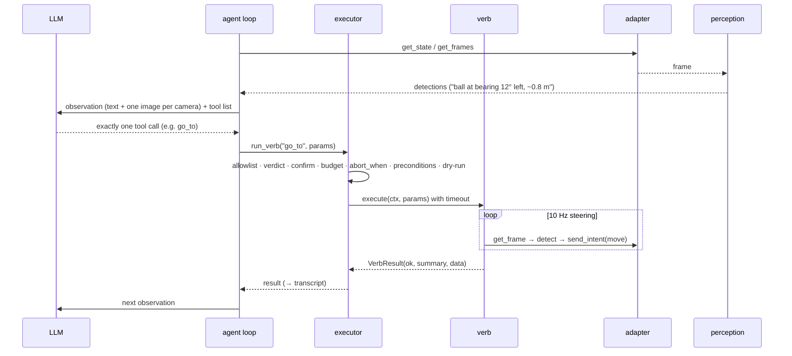

# Architecture

quackd is one command line for the robots you own: each joins through an adapter, each gets
an LLM for a pilot, and a flock of them works one task together. This page is the map, the
ADRs in [`adr/`](adr/) are the reasons.

## Three loops

| Loop | Rate | Where | Owner |
|---|---|---|---|
| Reflexes | the body's own (50 Hz on both ducks) | below quackd: `robotd` on a Microduck, quackd's own bridge daemon on an Open Duck, the position controller on an arm, the driver on a base | the robot's own controllers: RL policies (ONNX) for balance and gait on both ducks and for stand-up on the Microduck alone (a fallen Open Duck Mini needs a human), a learned pick policy on the arm when one is loaded. quackd writes none of this control code. It does *host* the loop on two bodies, both of which have no network API to talk to. On the Open Duck Mini it supplies only the seven numbers a gamepad would ([ADR-0024](adr/0024-open-duck-mini.md)). On the ToddlerBot it owns the fifty hertz loop outright, because that robot's `step()` is a no-op and a humanoid frozen mid-stride while a model thinks is a humanoid on the floor ([ADR-0028](adr/0028-toddlerbot.md)). Even there quackd writes no gait: the walk checkpoint is the robot's own. |
| Steering | 5–20 Hz | quackd process | perception + composite verbs. `go_to` (alias `walk_to`) closes the approach loop on detections. |
| Deliberation | ~0.2–1 Hz | LLM | reads frame summary + state + last result, picks one **verb**, judges success. |

Every design choice defends this separation: the LLM's only output is one tool call per
turn; composites never call the LLM; verbs send *intents*, never joint targets; the
adapter owns time, so the steering loop runs at sim speed in the simulator and in real
time on hardware without changing verb code. ([ADR-0003](adr/0003-three-loops.md))

One backend puts that first loop inside quackd's own process. `microduck:mujoco` steps
upstream's `alpha_walking.onnx` at the robot's own 50 Hz next to the agent loop, because a
simulated duck has no onboard computer to run it on. Nothing else changes: the transport
sends a twist and a head pose, quackd still writes no gait, and the boundary that is a
network hop on hardware is a function call here ([ADR-0030](adr/0030-mujoco-physics-backend.md)).

None of this needs to run on the robot's own computer. The only quackd code that *has to*
run on a robot lives in `bridge/` (see Modules below): the Open Duck Mini's pair of daemons, a
bridge and a camera server; a host wrapper for the AlohaMini; and a daemon for the
ToddlerBot. None of it carries model or perception code of its own.

The deciding half can run there too, when the robot's own computer is a Jetson.
[jetson.md](jetson.md) puts quackd and a local model beside the ToddlerBot's daemon on one
board, as separate processes over loopback, and none of it becomes the robot's control loop
([ADR-0044](adr/0044-a-jetson-is-a-host-not-a-body.md)).

Since 0.4 the robot side is an **adapter** that declares a **manifest**: what body it has,
which intents and sensors, which verbs. The registry, the tool list, the allowlist universe
and the system prompt are all built from that manifest at connect time; a verb that is not
in it does not exist. The Microduck was the first adapter and is still the one the starter
tasks mean. ([ADR-0017](adr/0017-robot-adapters-and-manifest.md),
[design/multi-robot.md](design/multi-robot.md))

Each of the seven adapters is also a distribution of its own, built from this repository as a
uv workspace member and installed by the extra that names it: `quackd[microduck]`,
`quackd[lerobot]`, `quackd[rosbridge]`, `quackd[open_duck]`, `quackd[xlerobot]`,
`quackd[alohamini]`, `quackd[toddlerbot]`, and `quackd[robots]` for all seven.
`uv pip install quackd` installs the core and no robot at all. An installed adapter announces
itself through the `quackd.adapters` entry point group, which is how the factory finds it and
the only way an adapter nobody here wrote can be found, so a third party can publish one
without a pull request to this repository. The core keeps a catalogue of the seven it publishes
(`quackd/adapters/catalogue.py`), which is why `quackd list-adapters` and `quackd doctor`
print the whole table on a machine with none of them installed, each row marked not
installed.

> [!IMPORTANT]
> With nothing installed there is no default robot: every command that needs a body refuses
> and names what to install. With exactly one adapter installed, that one is the default,
> because a machine with one robot has no ambiguity to resolve. With several installed
> including the Microduck, `microduck:sim2d` stays the default, because the six `duck: 0`
> starter files mean the cartoon and always have.

A pilot flock is that same sequence once per robot, all of them at once on wall-clock time.
The only thing the members share is the bus: `tell` puts a TALK message on it, and the
addressee reads it in its next observation. A coordinator flock replaces the LLM participant
with a deterministic referee on one lockstep clock ([flock.md](flock.md)).

## Modules

| Path | Why it exists |
|---|---|
| `quackd/cli.py` | The front door: `run · validate · doctor · serve-mcp · list-verbs · list-adapters · list-models · record · log · memory · robot · flock · discover · announce`. `--robot <adapter>:<backend>` or a registered name everywhere, with `--address`, `--camera-url` and `--token` for a real robot. `--camera-url` repeats for a body that reads several cameras, which today is the LeRobot arm and nothing else. |
| `quackd/duckfile/` | The `.duck` contract (v0, v1 and v2): strict pydantic frontmatter, parser, generated `schema.json`, `validate.py` (a task against one or more manifests). |
| `quackd/adapters/` | The robot-shaped part of the core, which contains no robot: `RobotManifest` (data: what a robot is and can do), the `RobotAdapter` protocol, `catalogue.py` (the seven bodies quackd publishes, as strings, importing none of them), and `factory.py`, the factory behind `--robot`, which finds an installed adapter through the `quackd.adapters` entry point group, imports it lazily, and refuses an adapter that is not installed with the extra to type. |
| `adapters/` | One distribution per robot, seven of them, each a member of the uv workspace and each imported as `quackd_<name>` rather than from the core. `microduck/` is the row below; `lerobot/` is a desktop arm (`mock`, `real`, [adapters/lerobot.md](adapters/lerobot.md)); `rosbridge/` is any wheeled base over rosbridge (`mock`, `ws`, [adapters/rosbridge.md](adapters/rosbridge.md)); `open_duck/` is an Open Duck Mini v2 (`sim2d`, `mock`, `bridge`, [adapters/open_duck.md](adapters/open_duck.md)), the first body whose robot side quackd also ships, in `bridge/open_duck/`, because its runtime has no network control API; `xlerobot/` is a dual-arm mobile manipulator (`mock`, `zmq`, [adapters/xlerobot.md](adapters/xlerobot.md)), the first body with both a base and arms, and the one quackd talks to by speaking its ZeroMQ host protocol rather than importing it, because upstream is not an installable package; `alohamini/` is two arms on a lift on a wheeled base (`mock`, `sim2d`, `zmq`, [adapters/alohamini.md](adapters/alohamini.md)), which quackd also reaches by speaking its ZeroMQ host protocol; `toddlerbot/` is a small humanoid (`mock`, `sim2d`, `bridge`, [adapters/toddlerbot.md](adapters/toddlerbot.md)), the third body whose robot side quackd ships, because upstream has no network API at all. Each declares its own `quackd.adapters` entry point, each depends on the core rather than the other way round, and every SDK-touching package owns an `upstream_api.py` and a containment test. |
| `adapters/microduck/` | The duck's own package, `quackd_microduck`, holding what only a Microduck has. `transports/` holds `jsonrpc` over `robotd`'s unix socket (experimental), `mujoco` (physics, needs `quackd[mujoco]`, which is `quackd-microduck[mujoco]`), the `websocket` stub and the factory that picks between them; `upstream_api.py` is the only file allowed to spell a Microduck upstream method; `webrtc.py` is the camera peer behind `quackd[microduck-camera]`. `sim3d/` is the physics world: the cartoon's arena minus its person, plus its seeds, deadman, kick cone and scoop, in MuJoCo. `world.py` steps a `Body`, and two exist, a kinematic puppet that needs no download and upstream's own Microduck model walking on upstream's own `alpha_walking.onnx` at 50 Hz. `assets.py` fetches the model and the policies at a pinned commit into `~/.quackd/cache` and checks every file against a recorded sha256; `sim3d/upstream_api.py` is the only file allowed to spell a `microduck_rl` name ([ADR-0030](adr/0030-mujoco-physics-backend.md)). |
| `quackd/upstream.py` | `UpstreamRef`: one upstream name and whether it is VERIFIED or UNVERIFIED, with its source. Every adapter's `upstream_api.py` is a list of these, so the type belongs to no robot. It lived in the Microduck's own file until the packages split, which made an arm import a duck to cite LeRobot ([adapter-status.md](adapter-status.md), [ADR-0022](adr/0022-per-adapter-upstream-refs.md)). |
| `quackd/verbs/` | `core.py`: the verbs any robot can carry and what each requires; `aliases.py`: the one alias table; `registry.py`: built from a manifest at connect time; `learned.py`: the v2 interface. |
| `quackd/safety.py` | The layer that does not trust the LLM: `Executor`, `Budget`, `Heartbeat`, `KillSwitch`. Preconditions arrive from the adapter; the executor spells none. |
| `quackd/verdict.py` | Whether this body can do this task at all: the words a pilot says it in, which verbs wait for the answer, and the matcher that says which other body could. Read by the prompt, the executor, the loop, the MCP server and a flock role, so a refusal and a role are worded the same ([ADR-0032](adr/0032-datasheets-and-the-verdict.md)). |
| `quackd/transport/` | The backend layer every body is built on: the `DuckTransport` protocol (frames in, state in, intents out, plus a heartbeat, a stop and time), the `sim2d` transport and the `mock`. Those two stayed in the core when the duck's transports left, because they were never the duck's: four other bodies subclass them, and every adapter's mock draws itself with the 2D renderer. |
| `quackd/sim2d/` | The cartoon world, two renders (top-down, duck-cam), the GIF recorder, the optional live window. |
| `quackd/perception/` | `Detection` + `Detector`; the HSV colour-blob default; the lazy YOLO extra. |
| `quackd/agent/` | The loop, the prompts, the transcript, and one provider per vendor behind `LLMProvider`. `images.py` is what `--image` goes through: it opens whatever a person passed, shrinks anything over 1568 px on a side or 1.5 MB, re-encodes every one of them to PNG, and hands back names the model can refer to, so a provider only ever meets PNG bytes and a caption. `providers/catalogue.py` is the single source of truth for model names: every id `--llm` accepts after the colon, its label, its status and whether the vendor documents image input, in a module that imports nothing but the standard library so the CLI can read it without paying for an SDK. `providers/factory.py` turns one `--llm VENDOR[:MODEL]` into a provider, splitting it at the first colon, inferring the vendor from a bare catalogue id, and refusing an unlisted cloud id before it reads a key. It reads no environment itself: `resolve_llm` settles the flag, then the robot's stored `llm`, then `QUACKD_LLM`, then `fake`, and hands the factory an answer that already knows which of the four named it. |
| `quackd/agent/providers/pricing.py` | Tokens into dollars: the rate a run is costed at (`--price`, then `QUACKD_PRICE`, then the catalogue's own entry, with `fake` and the local presets free by what they are rather than by any table) and the arithmetic that turns a `Usage` into a figure. A rate quackd does not have is `None` and prints `cost unpriced`, never `$0`, because a frontier model that reads as free is the one failure here that costs somebody real money; and where a rate is missing but tokens are not, the estimate goes up, so an unpublished cache rate is billed at the full input rate. Standard library and the catalogue and nothing else, because it sits beside the module every `--help` and every press of TAB already imports. |
| `quackd/agent/decision/` | The optional discrete stepper (`quackd run --decision-llm`, [decision-llms.md](decision-llms.md), [ADR-0040](adr/0040-a-discrete-stepper-in-front-of-the-model.md)). Six modules beside `__init__.py`: `catalogue.py` is every decision LLM quackd can name, as data, importing none of them, and every row of it has a page under `docs/decision-llms/` linked from [the hub's table](decision-llms.md#the-ones-quackd-names); `base.py` is the one-method `DecisionLLM` protocol every backend answers, and the three ways one can be absent; `factory.py` resolves the three flags and their four variables and builds one; `systemone.py` is the HTTP client every server speaks to, hosted or your own; `laya.py` is the one that runs in this process instead; and `stepper.py` is the half that belongs to none of them. It decides which of a body's tools are a *choice* rather than a number, from each tool's own JSON schema and nothing else, so `move_joints` is refused on every arm and a body quackd has never shipped is classified by the same rule as the seven that are. It builds the named text state and the questions, and reads the answer against a confidence floor per verb class. Nothing here imports `typesafe_sdk` or `laya` at module scope: the loop imports this package on every run and must not pay for a backend that is not in the run. |
| `quackd/log.py` | The run narrating itself: `LogEvent`, the `EventLog` that fans out to the transcript and to any number of views, the transport wrapper that turns every intent into an event, and the renderer both surfaces share ([ADR-0029](adr/0029-tracing.md)). |
| `quackd/memory.py` | What a robot keeps between runs: one JSONL file per `adapter:backend`, or per registered robot name, with the notes the pilot saved (`remember`) and an episode per run; rendered into the prompt next time ([memory.md](memory.md), ADR-0025, ADR-0034). |
| `quackd/registry.py` | The robots you have named and the flocks you made of them: `robots.json` and `flocks.json` under `~/.quackd`, strict reads, atomic writes, and `--robot NAME` resolution ([registry.md](registry.md), ADR-0034). |
| `quackd/mcp_server.py` | A robot, or a flock (`--robots`, or a stored flock with `--flock NAME`), as MCP tools: nine `robot_*` tools through one executor per robot. |
| `bridge/toddlerbot/` | quackd's own ToddlerBot daemon: the fifty hertz loop upstream has no daemon for, plus the ten things it does not do at all, enumerated in the daemon's own docstring and in `bridge/toddlerbot/README.md` rather than a third time here. It owns the control loop rather than feeding one, which is true of no other body quackd drives. Standard library plus numpy, never imported by quackd, shipped in the sdist and never in the wheel ([ADR-0028](adr/0028-toddlerbot.md)). |
| `bridge/alohamini/` | quackd's own AlohaMini host: upstream's host loop with the arm torque its own `configure()` disables and never re-enables, plus three fields in every observation so quackd can tell this host from a stock one. Never imports quackd, ships in the sdist and never in the wheel ([ADR-0027](adr/0027-alohamini.md)). |
| `bridge/open_duck/` | **The first robot side quackd shipped**, and one of the three above. It has still never run on a duck, and neither has either of the other two on the robot it was written for. One body in this table has been on hardware, and it is the one that needs no daemon: a LeRobot SO-101 arm, driven on 2026-09-15 ([lerobot-first-run.md](lerobot-first-run.md)). Two daemons for an Open Duck Mini v2's Raspberry Pi: the bridge, which is upstream's own walk loop with the gamepad it reads replaced by a socket, and the camera server, which serves one JPEG over HTTP. Standard library plus numpy, never imported by quackd, shipped in the sdist and never in the wheel ([ADR-0024](adr/0024-open-duck-mini.md)). |
| `deploy/jetson/` | A Dockerfile and a compose file for running quackd beside a local model server on an NVIDIA Jetson. Not a robot side and imported by nothing: it builds quackd from the checkout, with the third-party packages pinned by `uv.lock`, onto an arm64 image with no CUDA in it, because the GPU on that board belongs to the model server rather than to quackd. The one arrangement it unlocks is a ToddlerBot's own Jetson holding its control daemon, a model and quackd between them, over loopback ([jetson.md](jetson.md), [ADR-0044](adr/0044-a-jetson-is-a-host-not-a-body.md)). |
| `web/` | The same loop in a browser, and the only quackd code that is not Python: MuJoCo compiled to WebAssembly, the same two policies (`alpha_walking`, `alpha_stand`) in onnxruntime-web, seven of the same verbs under the same allowlist-and-budget machinery, with the model and the policies fetched from the same pinned upstreams. The kick there is quackd's own scripted impulse, as it is in `sim3d`. What the Python loop has no equivalent of is the second pair of hands: the sentence box and the keyboard are both live at once, so `runtime.manual` is a lease on the twist rather than a mode, and a key that would *move* the robot takes it mid-run while a key that only reads does not. Mounted at `/simulator`, which is why `web/serve.py` — stdlib, and the one piece of Python in `web/` — runs it locally rather than `http.server`. Live at <https://www.quackd.org/simulator>, which the separate quackd-web project builds from this directory. It shares no code with the package, so it is kept in step by hand and `tests/test_web.py` holds the parts that can be checked from Python, printing what to paste when they drift. The mechanism, the key map and where it diverges from `sim3d` are in [`web/README.md`](../web/README.md) rather than a second time here ([ADR-0030](adr/0030-mujoco-physics-backend.md)). |
| `quackd/lan/` | LAN discovery over zeroconf (`_quackd._tcp.local.`): a pure TXT wire format, `announce`, `discover`; behind `quackd[lan]` ([lan.md](lan.md)). |
| `quackd/flock/` | Many robots on one task, in two kinds. The coordinator: the in-process `Bus`, the typed messages, the Contract Net `Auction` and the role auction, the deterministic coordinator, the scripted member FSM, the one-call planner and the runner that judges from ground truth. The pilots: `talk.py` (the `tell` tool's end of the bus and the `Your flock` prompt section) and `pilots.py` (one `AgentLoop` per body on wall clock, no referee, each member declaring for itself) ([flock.md](flock.md), ADR-0034). |
| `quackd/flock/mqtt_bus.py` | The flock `Bus` protocol over an MQTT broker, library only; the in-process bus stays the default. |
| `quackd/doctor.py` | What can run here and what we are assuming about the robot. |

## A turn, concretely

1. **Observe.** `transport.get_state()` → `DuckState`; `frames_of(transport)` → every camera's
   newest picture, the primary first → `detector.detect()` on the primary → `[Detection]`. Only
   the primary is detected on, because a bearing is only meaningful from the lens `--fov-deg`
   measured, and a provider with vision is still shown every frame, each labelled with its
   camera's name. All of them are saved to `runs/<ts>/frames/`: `0000.png` for a body with one
   camera, and `0000-top.png` beside `0000-side.png` for a body with several, so the number
   still says which step and the name says which view. Only the LeRobot arm reads more than one
   camera today. A picture handed to the task with `--image` came from no camera and belongs to
   no step, so it is written to `runs/<ts>/images/` instead, numbered in the order the flags
   were given: `00-sketch.png`. Those are the re-encoded PNG bytes the model was actually sent
   rather than the file on disk, so an argument about a run afterwards is held over the picture
   the pilot saw.
2. **Think.** The provider gets: the system prompt (contract in prose + the `.duck` body),
   the vendor-neutral history (`Exchange` = observation + decision), and the tool list
   (allowed verbs' JSON schemas + `assess_task` / `declare_success` / `declare_failure`, plus
   `tell` in a pilot flock, plus `remember` when memory is on). With memory on the prompt also
   carries what this robot remembers from earlier runs. Only the last two observations keep
   their images, which is two pictures per request on a body with one camera and four on a body
   with two, and up to nine observations on Claude Opus 5.5 and Fable 5.1, whose old frames are
   trimmed every eight exchanges rather than on every one. A task picture is not one of those:
   it rides on the first observation and only that one, and the trim never takes it, so the
   thing the task is about is still in front of the model at the last step. The provider must
   return one tool call.

   With `--decision-llm` the optional discrete stepper is asked first, and only ever offered
   the calls the executor would run *this* turn: the ones the allowlist permits, whose
   parameters are a closed set, and which are not waiting on a feasibility verdict. Where it is
   confident enough the turn ends there and the provider is not called at all. Where it is not,
   or where the right answer is a number or a sentence, the provider is called exactly as above.
   A turn the stepper answered appends nothing to the history the provider is handed, because
   none of it is anything the provider said, and the model is told what happened in one line on
   the next observation it is actually shown ([decision-llms.md](decision-llms.md)).
3. **Enforce.** Zero tool calls → one re-prompt, then failure. Several → the first. Then
   `Executor.run_verb`: abort flag → allowlist → verdict → params → confirm → budget → machine-enforced
   `abort_when` → preconditions → dry-run → execute, racing the timeout against the abort.
   `stop` is exempt from the abort gate, so the brake still works after one.
4. **Act.** The verb runs; composites loop on the camera at 10 Hz; `move` re-sends its
   velocity every 100 ms to feed the robot's deadman.
5. **Record.** Every step above is a `LogEvent`, and `transcript.jsonl` is the sink that
   never turns off (every kind it writes is in the table below); `frames/` as the run goes and
   `images/` once at the top of it; `summary.json` at the end; `terminal.txt`, everything that
   was on the terminal during the run as plain text, opening with the command that started it
   and the version that ran it;
   `run.gif` from the recorder in either simulator. The directory all of that lands in says
   when, which task, and what you called it: `runs/20260921-155444-find-and-kick-example-1`
   is `--run-name "Example 1"`, slugged. The label goes after the task name and before the
   collision counter, so the timestamp prefix and the task name both still resolve in
   `quackd log` and two runs named the same thing in the same second read as `-example-1` and
   `-example-1-1`. A name with no letter or digit in it is refused before anything connects,
   alongside a `--price` nobody can parse, because a typing mistake should cost you one
   sentence rather than a robot moving and a directory to clean up after. With memory on, the
   run ends by appending one episode line to the robot's memory file ([memory.md](memory.md)).
   The terminal and the MCP tool results are views of the same stream (see [Log](#log)).

Step 0, before all of that: the loop calls `connect()` and, when an adapter answers with a
manifest, builds the registry from it (`registry_from_manifest`). A bare transport answers
`None` and gets the Microduck vocabulary. A body with a rest pose recorded for it is driven
there in the same breath, so what a model improvises from is the same body every time, and a
run that cannot get there ends before it has spent a single LLM call. The mirror of that move
is in the loop's `finally`, between the last `stop` and the disconnect, on every outcome below
and on Ctrl-C. A dry run does neither, because it moves nothing ([safety.md](safety.md)).

Outcomes: `success` / `failure` (the LLM's claim via the meta tools), `infeasible` (the
pilot judged the task beyond this body before anything moved, and `quackd run` exits 3),
`budget`, `aborted` (heartbeat, kill switch, `abort_when`) and `error`, which nobody chose:
a provider that failed, a transport that died mid-observation, a bug. In sim the run summary
also carries ground truth (`final_state.extras.ball_displacement_m`) so tests judge the
claim.

## Transcript format

One JSON object per line: `{"t": seconds, "kind": ..., ...}`.

| Kind | What it records |
|---|---|
| `task_image` | one per picture `--image` brought to the task, written before `run_start` so a reader of the record meets the pictures the task is about before the run that was given them: where it landed under `images/`, the name the model sees it by, and how many bytes of PNG that is |
| `run_start` | contract, system prompt, tool names, robot manifest, the names of the pictures the task came with (`images`, empty on a run given none), any `extra_body` sent with every request, with its credential-named keys already replaced by `***`, how long connecting took (`connect_s`), what the run was called (`run_name`, the text as it was typed rather than the slug the directory got), the command that started it (`command`, as a list, with the value of `--api-key` and `--token` replaced by `***` and a URL flag's password and credential-named query parameters with it, see [SECURITY.md](../SECURITY.md)) and the version that ran it (`version`), when `t = 0` was (`started_at`, the one absolute time in the whole file: every other record's wall time is that plus its own `t`), and the rate this run is being costed at (`price`, with `decision_price` beside it when a stepper ran and `decision_llm` saying which one answered, as `{name, model, url}` with the url's password and credential-named query parameters replaced by `***`, because a record that said only `jev-1.13.0` could not tell a reader whether that was TypeSafe's API or a server on the bench), written down here rather than looked up at replay so a run is always priced at what it cost on the day |
| `observation` | what the model was shown this turn, and how long gathering it took |
| `llm_request` | how many messages went out, how many still carry an image (`with_image`), how many camera frames that is (`images`, which differs from `with_image` only on a body with several cameras), and separately how many pictures came with the task rather than from a camera (`task_pictures`, counted on its own and never inside `images`, and the same number every step of a run that was given any), whether this is the re-prompt |
| `llm` | text, `thinking`, tool_calls, usage (this turn and the run's total, `input_tokens` being the whole prompt with `cache_read_tokens` and `cache_write_tokens` the slices of it that were billed at cache rates rather than additions to it), stop_reason, latency, and what this call cost beside what the run has spent so far (`cost_usd` and `cost_usd_total`, both null on a run quackd has no rate for, because a frontier model recorded as zero reads as a free one), `served_by` only on a turn a server-side refusal fallback re-ran on another model (Claude), naming the model that answered, or `error` when the call failed |
| `enforce` | zero tool calls (re-prompt) or several (first only) |
| `decision` | one per turn the optional discrete stepper was asked, in both of its modes and with the same fields in each, so a `--decision-mode on` row and a `--decision-mode shadow` row can be read against each other: the labels it was offered, the one it chose, the whole probability distribution, its confidence, the floor that applied and which gate fired (`taken` · `below_floor` · `escalate` · `repeat` · `handover` · `unreadable` · `done` · `need_human` · `not_offered` · `state_too_large` · `error`), the two Noul values, how long it took, how large the state was and which fields were trimmed to fit, and what the question itself cost: `usage` (the tokens it spent), `usage_estimated` (true where the server reported no count of its own and quackd fell back to the state plus the questions at four characters to the token, because an estimate a reader cannot tell from a measurement is worse than no number at all) and `cost_usd` at whatever rate that decision LLM was resolved to, which for every server you run yourself is the self-hosted `$0`. Those three are absent on a turn that never reached the network at all, which is every `not_offered` and `state_too_large` gate and a call that failed before the request went out, because a machine with no client installed owes nobody anything ([decision-llms.md](decision-llms.md)) |
| `decision_shadow` | only on `--decision-mode shadow`, after that step's `llm` record: what the stepper would have chosen beside what the model actually chose on the same reading (`decision_choice`, `decision_confidence`, `decision_gate`), whether they agree (on the whole call, since `gripper(open=true)` and `gripper(open=false)` are opposite instructions that share a name, with `same_verb` recording the coarser comparison beside it), whether the stepper cleared its floor (`would_have_acted`), and what each of them cost in seconds and in dollars (`llm_latency_s` with `llm_usage` and `llm_cost_usd` for the model, `decision_latency_s` and `decision_cost_usd` for the stepper), which is the ratio the whole mode exists to measure and the one [decision-llms.md](decision-llms.md) could previously only reach by arithmetic. Either of those two figures can be null, the model's where nobody publishes a rate for it and the stepper's where the turn never reached the network. A shadow run changes nothing, so this is the only mark it leaves |
| `verb_start` | name as called, canonical name, params, source (`agent` · `mcp` · `cli` · `decision`, the last of which is a verb the discrete stepper chose and the model never saw), whether it is nested inside a composite |
| `gate` | one per executor rule that fired: `abort` · `allowlist` · `unknown` · `verdict` · `params` · `confirm` · `budget` · `abort_when` · `precondition` · `dry_run` · `cancelled`, with the reason and, where it matters, the robot state that caused it |
| `prompt` | a question a **person** was put at the terminal, and what they answered: `what` (`confirm` · `decide` · `acknowledge` · `hand_off` · `release`), the `question` in the words it was asked in, and the `answer`. Written only where somebody was really there: `--yes`, a flock member and any other standing answer decide without asking, and none of them writes a row here. What the answer *caused* is recorded by whoever acted on it (`gate.answer`, `assess.human`, the `hand_off` and `release` stages); this is the exchange itself, which nothing used to hold |
| `intent` | every command sent to the robot: kind, params, whether it was accepted, and the robot's own clock when it has one |
| `verb_end` | outcome (`ok` · `fail` · `refused` · `denied` · `budget` · `aborted` · `preempted` · `error`), summary, wall seconds, the robot's own seconds on a simulator, and how many intents of each kind it sent |
| `verb` | the loop's own record of the call it made (name, params, ok, summary, data) |
| `assess` | the pilot's feasibility verdict on this task against this body: the word, the reason, the datasheet fields it read, what it estimated about the world and how, what the task would need, whether a person cleared it, and whether the run ends there |
| `talk` | one pilot to another in a flock: who said it, to whom (a member name or `all`), the words, and whether the message was accepted. Sent through the `tell` tool, so it moves nothing and counts as no step ([flock.md](flock.md)) |
| `hand_off` | only on a `--by-hand` run: the moments where the arm belongs to a person rather than to the pilot. `stage` says which moment it is: `released` (torque is off at the recorded rest pose and the arm is yours), `held` (the pose you left it in was written as the goal and read back, with the `joints` it read), `skipped` (the end-of-run wait ran out with nobody there, or a second Ctrl-C landed on it, so the gripper was not opened) and `unloaded` (somebody took what was in the gripper, so the gripper opens before the arm folds). `how` is the arm's own word for what happened, `released` · `held` · `refused`, so a stage the arm refused is on the record as loudly as one it took |
| `release` | only at the end of a run whose last rest move missed while the arm still answered, with a person at the terminal: the offer to take torque off the arm while they hold it, which the run makes between that rest move and the close. `stage` is `released` (Enter came and the arm was asked to let go where it stands, with `how` the arm's own word, `released` or `refused`, the `joints` it was at, and `torque_on`, the joints whose torque still read on afterwards: empty when every one read off, null when nothing was read back), `kept` (torque stays on as it would have without the offer, and `reason` says why: `nobody pressed Enter` for a wait that ran out, `no key could be read` for a terminal with nothing to read, `interrupted while waiting` for a Ctrl-C, the run's first or a later one) or `interrupted` (a Ctrl-C landed on the release itself, after Enter, so part of the arm or all of it may be limp, and the close says it is in a hand). Never on a dry run, an MCP session or a flock member, and never over an arm whose rest move failed because it stopped answering ([adapters/lerobot.md](adapters/lerobot.md#releasing-it-where-it-stands)) |
| `declare`, `memory`, `note`, `frame`, `run_end` | the model's verdict, a saved note, a free-text line, a captured frame (one record per camera, each naming its own, on a body with several), and the summary, which is `summary.json` verbatim: the outcome and the counts, the three clocks (`wall_s` the run as a person stood through it, `elapsed_s` the budget's own, and `connect_s` with `llm_latency_s` splitting out the two waits worth naming separately), the wall time at either end of it (`started_at` and `ended_at`, the second of which is the first plus `wall_s` rather than a second reading of the clock), what the run cost and what it was costed at (`cost_usd` and `price`, with the stepper's own bill in the `decision` block beside them, which also says which decision LLM answered, in which mode, at which url and for what), the `command` and the `version`, which a solo run repeats from `run_start` so the summary answers on its own and a flock root writes here first hand, having no `run_start` of its own, and `log_dropped`: events a view raised on and never showed |

Example: [`assets/transcript-example.jsonl`](assets/transcript-example.jsonl), recorded
before the log's own kinds existed.

## Log

The log is an event stream, and the transcript is one *sink* of it rather than a thing the
loop writes directly ([ADR-0029](adr/0029-tracing.md)). The same events drive three live
views, all on by default:

- **The terminal** (`quackd run`), on stderr, so `2> run.log` keeps the outcome on screen.
  It shows the system prompt once, then per turn: the observation, what the model thought,
  the tool it called, tokens, latency and what the call cost, each gate that fired, each
  intent, and the result.
  A burst of intents from a steering loop is one line with its parameter ranges, because
  `go_to` recomputes its twist every 100 ms: `→  send    move x42 over 4.1 s (vx 0.1..0.2, vy 0, wz -0.055..0.01)`.
  A burst still going after two seconds is flushed as it stands and the next line continues
  it, so a long approach narrates itself instead of printing nothing until it ends.
- **The MCP tool result**, as a `log` list on every call that reaches an executor, capped
  at thirty lines, with the uncapped version on the server's stderr. Over MCP the pilot is
  the client, so its reasoning and its token counts are not quackd's to show. What quackd can
  see it says: the verb, the gates, the intents, the result and the budget.
- **A flock's terminal**, one view per member with its name and its own colour on every line,
  and the coordinator's decisions under `flock`. Each robot's own transcript is its record.

`quackd log` replays a finished run from its transcript afterwards, through the same
renderer, on stdout, under a header that says when the run was, what it was called and what it
was costed at, and above the same counter line the live run printed. With nothing after it you
get the newest run, which is what you want the moment one ends. What you do type is resolved in
order: a transcript file, a directory, an exact name under `--runs-dir`, the newest directory
carrying that `--run-name`, a timestamp prefix, and only then the newest whose name merely
contains the text. The name pass is the reason `quackd log example-1` finds the run you
named: a bench session has `-example-1` and `-example-19` in it, and a substring match hands
you whichever of the two happens to be newer. It sits above the timestamp prefix because a
name can be all digits, and a run you called `20260921` would otherwise be answered by
whichever run's stamp started the same way. It matches the name against what follows the
stamp and only where a duck name comes first, so `quackd log find-and-kick` still means the
newest run of that duck rather than the one that happened to go unnamed.

`--no-log` or `QUACKD_LOG=0` removes the views. A one-line status stays on stderr either way,
saying what the run is waiting for, because a model deciding and a verb steering a robot are
most of a run's wall clock and both used to be silence.

What that flag stops is the run narrating itself to your terminal. The log in the run
directory is written either way and is not optional: `transcript.jsonl` gets every event on
every run, with `--no-log` or without it, because a run that cannot be argued about afterwards
is the thing this project cannot give up. The new name makes the other reading easy, so it is
said plainly here: the flag is about what you watch, not about what is kept.

What you watched is kept as well, as `terminal.txt` in the run directory: the screen as plain
text with no colour codes in it, opening with the command that started the run and the version
that ran it. It is the screen and not the record, so what `--no-log` takes off the terminal is
missing from the file too, and the questions you were asked are in it with the answers you
typed, which the terminal echoed and no view ever printed. It buffers from the first line and
moves into the directory the moment there is one, so a run refused before there is a directory
leaves nothing behind to clean up.

`--no-log-prompt` or `QUACKD_LOG_PROMPT=0` keeps the narration and drops the system prompt,
which is forty to seventy lines and worth reading once. `QUACKD_LOG_THINKING` is how much of
the model's thinking each turn shows: a number of characters, `all`, or `0`. The transcript
always has all of it.

All of this was the *trace* until 0.11, and the record outgrew the word: it holds every prompt,
gate and intent, the robot's own movement, the three clocks and what the model cost.
The old subcommand, the two old flag pairs and the three old variable names had one
release of grace, each printing one yellow line naming what it is called now, and 0.12 removed
them, which is how the flag `--robot` replaced was retired over 0.4 and 0.5
([ADR-0017](adr/0017-robot-adapters-and-manifest.md)). An old flag or subcommand is refused the
way any unknown one is. An old variable name is a quieter failure and is answered rather than
dropped: a name still set in a shell or a `.env` is ignored and named in one yellow line before
the header, the line an old model variable gets, because a name that simply stopped being read
would switch the log back on for the one reader who had deliberately turned it off
([ADR-0042](adr/0042-the-log-is-the-whole-screen.md)). A run directory recorded before the
rename replays unchanged, because the reader takes `trace_dropped` as well as `log_dropped`.
The MCP result key is the one that changed outright, with no release of grace: a model learns
that name from the tool description on every call, and carrying both would cost it a second
copy of up to thirty lines every time it used a tool ([mcp.md](mcp.md)).

### Time and money

A run is timed by three clocks, and all three are in the summary because they answer three
different questions and no two of them are interchangeable:

- `wall_s` is the run as somebody standing next to the robot experienced it, from the moment
  the record opened to the moment it closed, connecting and teardown included.
- `elapsed_s` is the **budget's** clock, the one a `.duck`'s `budgets.max_minutes` is checked
  against and all it is. It starts after `run_start` rather than at the top of the run, it
  restarts after a `--by-hand` handover, and it reads the transport's own time, which on a
  simulator is the simulator's.
- `connect_s` and `llm_latency_s` lift out the two waits worth naming on their own: getting to
  the robot at all, and sitting waiting on the model. On the one hardware run this project has,
  62.1 of 78.8 seconds were the model, and that ratio is the most useful single number a run
  produces. It used to have to be added up by hand from the transcript to say so.

> [!WARNING]
> `elapsed_s` and `wall_s` do not measure the same span and neither one bounds the other. The
> published `find-and-kick` transcripts predate `wall_s` entirely, but a fresh run of that
> duck on the cartoon at seed 3 records `elapsed_s` 7.8 against a `wall_s` under two tenths of
> a second: the cartoon runs nearly eight seconds of duck time inside a fifth of a second of
> yours, and `elapsed_s` is the same 7.8 on any machine while `wall_s` is whatever yours took.
> Divide a cost or a token count by the wrong one and the answer is off by a factor of forty.

`started_at` is the single wall anchor. It is read in the same breath as the monotonic clock
every record's `t` counts from, so any record's wall time is `started_at + t` and the two
hundred intents of a steering burst need not each carry an ISO string to say when they were.
`ended_at` is derived the same way, `started_at` plus `wall_s`, rather than read off the clock
a second time: a laptop that synced its clock mid-run or slept through part of one moves
`datetime.now()` by an amount the monotonic clock never sees, and
`ended_at - started_at == wall_s` is arithmetic every reader of these files will do without
thinking to check it first.

Tokens are recorded in the buckets a bill is itemised by, normalised across vendors, because a
number that means one thing on Anthropic and another on Gemini cannot be added up or multiplied
by a rate. `input_tokens` is the WHOLE prompt, cached or not; `cache_read_tokens` and
`cache_write_tokens` are slices of that number rather than additions to it, so `input_tokens`
stays the figure a reader has always seen whether or not a cache was in play; `output_tokens`
is everything generated, thinking included, because that is what the output rate is charged on;
and `reasoning_tokens` is the slice of the output the vendor counts apart, recorded and never
priced a second time.

Rates are USD per million tokens, read off each vendor's own page on a dated check
(`PRICES_CHECKED`, `2026-09-21` here) and carried on the model's own catalogue entry. Three
sources, in the order a person expects to be obeyed:
`--price in=3,out=15,cache_read=0.3,cache_write=3.75`, then `QUACKD_PRICE` with the same
syntax, then the catalogue. An override beats `fake` as well as the catalogue, and that is
deliberate: pricing a scripted run is how the whole cost path gets exercised end to end with no
key and no bill. `fake` and the local presets are free by what they are rather than by any
table, and a paid OpenAI-compatible endpoint behind `--llm local --base-url` is the case
`--price` is there for. The discrete stepper bills separately at its own rate, which is
TypeSafe's published one for `jev` and the self-hosted `$0` for every server you run
yourself, because a machine of your own bills you in electricity rather than in tokens.
`QUACKD_DECISION_PRICE` overrides it in the same syntax, and a paid endpoint behind
`--decision-llm local` is the case that needs it ([decision-llms.md](decision-llms.md)).

> [!NOTE]
> A rate quackd does not have records `null` and prints `cost unpriced`, never `0`. Four of
> the catalogue's 117 models are unpriced today, all of them Cohere's, the Command A family and
> North Mini Code, for which Cohere publish no per-token rate at all. A model that is genuinely free is a rate of
> zero and prints `$0`, which is a different claim from "nobody knows". Where a rate is missing
> but the tokens are not, the estimate goes up rather than down: an unpublished cache rate is
> billed at the full input rate, because a bill that is too low is the one that gets believed.

Whichever rate applied is written into `run_start` and `summary.json` with its source and the
date it was checked, so `quackd log` costs a run at what it cost on the day rather than at
whatever the catalogue says months later, and a rate that turns out to have been wrong is
visible in the runs it priced rather than silently reapplied to all of them.

### What the terminal adds, and what it may not change

The MCP result carries the renderer's lines verbatim and a model reads them, so those bytes
are frozen: `->`, `<-`, an eight-column label, ASCII throughout, held to it case by case by
`tests/golden/log_lines.json`. A person at a terminal is a different reader, so the same
events are drawn differently there ([ADR-0033](adr/0033-terminal-theme.md)): the arrow is a
glyph in a gutter and the column says the word it stood for (`send`, `result`), each step is
ruled off with the budget lifted out of the observation, the system prompt is an indented
block between two rules, and an outcome is a shape as well as a colour.

Which glyphs are used is decided by the stream being written to, not by the platform. A
redirected stderr on Windows is cp1252 and gets `->`, `+` and `x`; a terminal that can draw
an arrow gets one. Nothing is ever printed as markup, because a model that thinks about
`[/think]` must not raise a formatting error.

The log shows intents as verbs issue them. A keepalive inside an adapter, a daemon's own
deadman resend and an adapter's stop-on-close are that adapter's business and appear only in
its logs.

## Where the seams are

- **Providers** — add a file under `agent/providers/`, a tuple in `agent/providers/catalogue.py`
  (which is where the vendor's name, its model ids and its default come from), and its rows in
  `factory.py`. The browser demo's copy of the model list is generated rather than written:
  `python web/build_catalogue.py` rewrites `web/src/catalogue.js` from the same catalogue, and
  `tests/test_web.py` fails if the committed file is not what the generator produces. What the
  entries are and what counts them: [CONTRIBUTING.md](../CONTRIBUTING.md).
- **Detectors** — implement `detect(image) -> list[Detection]`; upstream's future feature
  stream becomes one more detector that reads a socket.
- **Robots** — a package under `adapters/` with `describe()` (the static manifest),
  `make()` (a `RobotAdapter`), `implementations()` (its own verbs) and `conditions()`
  (its named preconditions); keep upstream names in its own `upstream_api.py`. The factory
  finds that package by its `quackd.adapters` entry point, so it does not have to be one of
  the seven here: publish `quackd-<robot>`, declare the entry point, and
  `--robot <name>:<backend>` reaches it with no change to this repository
  ([adapters.md](adapters.md)).
- **Learned verbs** — `register_learned_verb(registry, spec, runner)`; see
  [learned-verbs.md](learned-verbs.md).
