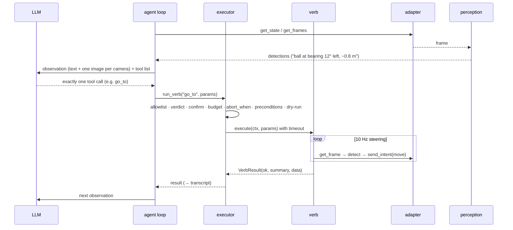

# Architecture

quackd is one command line for the robots you own: each joins through an adapter, each gets
an LLM for a pilot, and a flock of them works one task together. This page is the map, the
ADRs in [`adr/`](adr/) are the reasons.

## Three loops

| Loop | Rate | Where | Owner |
|---|---|---|---|
| Reflexes | the body's own (50 Hz on both ducks) | below quackd: `robotd` on a Microduck, quackd's own bridge daemon on an Open Duck, the position controller on an arm, the driver on a base | the robot's own controllers: RL policies (ONNX) for balance and gait on both ducks and for stand-up on the Microduck alone (a fallen Open Duck Mini needs a human), a learned pick policy on the arm when one is loaded. quackd writes none of this control code. It does *host* the loop on two bodies, both of which have no network API to talk to. On the Open Duck Mini it supplies only the seven numbers a gamepad would ([ADR-0024](adr/0024-open-duck-mini.md)). On the ToddlerBot it owns the fifty hertz loop outright, because that robot's `step()` is a no-op and a humanoid frozen mid-stride while a model thinks is a humanoid on the floor ([ADR-0028](adr/0028-toddlerbot.md)). Even there quackd writes no gait: the walk checkpoint is the robot's own. |
| Steering | 5–20 Hz | quackd process | perception + composite verbs. `go_to` (alias `walk_to`) closes the approach loop on detections. |
| Deliberation | ~0.2–1 Hz | LLM | reads frame summary + state + last result, picks one **verb**, judges success. |

Every design choice defends this separation: the LLM's only output is one tool call per
turn; composites never call the LLM; verbs send *intents*, never joint targets; the
adapter owns time, so the steering loop runs at sim speed in the simulator and in real
time on hardware without changing verb code. ([ADR-0003](adr/0003-three-loops.md))

One backend puts that first loop inside quackd's own process. `microduck:mujoco` steps
upstream's `alpha_walking.onnx` at the robot's own 50 Hz next to the agent loop, because a
simulated duck has no onboard computer to run it on. Nothing else changes: the transport
sends a twist and a head pose, quackd still writes no gait, and the boundary that is a
network hop on hardware is a function call here ([ADR-0030](adr/0030-mujoco-physics-backend.md)).

None of this needs to run on the robot's own computer. The only quackd code that ever runs
on a robot lives in `bridge/` (see Modules below): the Open Duck Mini's pair of daemons, a
bridge and a camera server; a host wrapper for the AlohaMini; and a daemon for the
ToddlerBot. None of it carries model or perception code of its own.

Since 0.4 the robot side is an **adapter** that declares a **manifest**: what body it has,
which intents and sensors, which verbs. The registry, the tool list, the allowlist universe
and the system prompt are all built from that manifest at connect time; a verb that is not
in it does not exist. The Microduck was the first adapter and is still the one the starter
tasks mean. ([ADR-0017](adr/0017-robot-adapters-and-manifest.md),
[design/multi-robot.md](design/multi-robot.md))

Each of the seven adapters is also a distribution of its own, built from this repository as a
uv workspace member and installed by the extra that names it: `quackd[microduck]`,
`quackd[lerobot]`, `quackd[rosbridge]`, `quackd[open_duck]`, `quackd[xlerobot]`,
`quackd[alohamini]`, `quackd[toddlerbot]`, and `quackd[robots]` for all seven.
`uv pip install quackd` installs the core and no robot at all. An installed adapter announces
itself through the `quackd.adapters` entry point group, which is how the factory finds it and
the only way an adapter nobody here wrote can be found, so a third party can publish one
without a pull request to this repository. The core keeps a catalogue of the seven it publishes
(`quackd/adapters/catalogue.py`), which is why `quackd list-adapters` and `quackd doctor`
print the whole table on a machine with none of them installed, each row marked not
installed.

> [!IMPORTANT]
> With nothing installed there is no default robot: every command that needs a body refuses
> and names what to install. With exactly one adapter installed, that one is the default,
> because a machine with one robot has no ambiguity to resolve. With several installed
> including the Microduck, `microduck:sim2d` stays the default, because the six `duck: 0`
> starter files mean the cartoon and always have.

A pilot flock is that same sequence once per robot, all of them at once on wall-clock time.
The only thing the members share is the bus: `tell` puts a TALK message on it, and the
addressee reads it in its next observation. A coordinator flock replaces the LLM participant
with a deterministic referee on one lockstep clock ([flock.md](flock.md)).

## Modules

| Path | Why it exists |
|---|---|
| `quackd/cli.py` | The front door: `run · validate · doctor · serve-mcp · list-verbs · list-adapters · list-models · record · trace · memory · robot · flock · discover · announce`. `--robot <adapter>:<backend>` or a registered name everywhere, with `--address`, `--camera-url` and `--token` for a real robot. `--camera-url` repeats for a body that reads several cameras, which today is the LeRobot arm and nothing else. |
| `quackd/duckfile/` | The `.duck` contract (v0, v1 and v2): strict pydantic frontmatter, parser, generated `schema.json`, `validate.py` (a task against one or more manifests). |
| `quackd/adapters/` | The robot-shaped part of the core, which contains no robot: `RobotManifest` (data: what a robot is and can do), the `RobotAdapter` protocol, `catalogue.py` (the seven bodies quackd publishes, as strings, importing none of them), and `factory.py`, the factory behind `--robot`, which finds an installed adapter through the `quackd.adapters` entry point group, imports it lazily, and refuses an adapter that is not installed with the extra to type. |
| `adapters/` | One distribution per robot, seven of them, each a member of the uv workspace and each imported as `quackd_<name>` rather than from the core. `microduck/` is the row below; `lerobot/` is a desktop arm (`mock`, `real`, [adapters/lerobot.md](adapters/lerobot.md)); `rosbridge/` is any wheeled base over rosbridge (`mock`, `ws`, [adapters/rosbridge.md](adapters/rosbridge.md)); `open_duck/` is an Open Duck Mini v2 (`sim2d`, `mock`, `bridge`, [adapters/open_duck.md](adapters/open_duck.md)), the first body whose robot side quackd also ships, in `bridge/open_duck/`, because its runtime has no network control API; `xlerobot/` is a dual-arm mobile manipulator (`mock`, `zmq`, [adapters/xlerobot.md](adapters/xlerobot.md)), the first body with both a base and arms, and the one quackd talks to by speaking its ZeroMQ host protocol rather than importing it, because upstream is not an installable package; `alohamini/` is two arms on a lift on a wheeled base (`mock`, `sim2d`, `zmq`, [adapters/alohamini.md](adapters/alohamini.md)), which quackd also reaches by speaking its ZeroMQ host protocol; `toddlerbot/` is a small humanoid (`mock`, `sim2d`, `bridge`, [adapters/toddlerbot.md](adapters/toddlerbot.md)), the third body whose robot side quackd ships, because upstream has no network API at all. Each declares its own `quackd.adapters` entry point, each depends on the core rather than the other way round, and every SDK-touching package owns an `upstream_api.py` and a containment test. |
| `adapters/microduck/` | The duck's own package, `quackd_microduck`, holding what only a Microduck has. `transports/` holds `jsonrpc` over `robotd`'s unix socket (experimental), `mujoco` (physics, needs `quackd[mujoco]`, which is `quackd-microduck[mujoco]`), the `websocket` stub and the factory that picks between them; `upstream_api.py` is the only file allowed to spell a Microduck upstream method; `webrtc.py` is the camera peer behind `quackd[microduck-camera]`. `sim3d/` is the physics world: the cartoon's arena minus its person, plus its seeds, deadman, kick cone and scoop, in MuJoCo. `world.py` steps a `Body`, and two exist, a kinematic puppet that needs no download and upstream's own Microduck model walking on upstream's own `alpha_walking.onnx` at 50 Hz. `assets.py` fetches the model and the policies at a pinned commit into `~/.quackd/cache` and checks every file against a recorded sha256; `sim3d/upstream_api.py` is the only file allowed to spell a `microduck_rl` name ([ADR-0030](adr/0030-mujoco-physics-backend.md)). |
| `quackd/upstream.py` | `UpstreamRef`: one upstream name and whether it is VERIFIED or UNVERIFIED, with its source. Every adapter's `upstream_api.py` is a list of these, so the type belongs to no robot. It lived in the Microduck's own file until the packages split, which made an arm import a duck to cite LeRobot ([adapter-status.md](adapter-status.md), [ADR-0022](adr/0022-per-adapter-upstream-refs.md)). |
| `quackd/verbs/` | `core.py`: the verbs any robot can carry and what each requires; `aliases.py`: the one alias table; `registry.py`: built from a manifest at connect time; `learned.py`: the v2 interface. |
| `quackd/safety.py` | The layer that does not trust the LLM: `Executor`, `Budget`, `Heartbeat`, `KillSwitch`. Preconditions arrive from the adapter; the executor spells none. |
| `quackd/verdict.py` | Whether this body can do this task at all: the words a pilot says it in, which verbs wait for the answer, and the matcher that says which other body could. Read by the prompt, the executor, the loop, the MCP server and a flock role, so a refusal and a role are worded the same ([ADR-0032](adr/0032-datasheets-and-the-verdict.md)). |
| `quackd/transport/` | The backend layer every body is built on: the `DuckTransport` protocol (frames in, state in, intents out, plus a heartbeat, a stop and time), the `sim2d` transport and the `mock`. Those two stayed in the core when the duck's transports left, because they were never the duck's: four other bodies subclass them, and every adapter's mock draws itself with the 2D renderer. |
| `quackd/sim2d/` | The cartoon world, two renders (top-down, duck-cam), the GIF recorder, the optional live window. |
| `quackd/perception/` | `Detection` + `Detector`; the HSV colour-blob default; the lazy YOLO extra. |
| `quackd/agent/` | The loop, the prompts, the transcript, and one provider per vendor behind `LLMProvider`. `providers/catalogue.py` is the single source of truth for model names: every id `--model` accepts, its label, its status and whether the vendor documents image input, in a module that imports nothing but the standard library so the CLI can read it without paying for an SDK. `providers/factory.py` turns `--provider` and `--model` into a provider, refusing an unlisted cloud id before it reads a key. |
| `quackd/trace.py` | The run narrating itself: `TraceEvent`, the `Tracer` that fans out to the transcript and to any number of views, the transport wrapper that turns every intent into an event, and the renderer both surfaces share ([ADR-0029](adr/0029-tracing.md)). |
| `quackd/memory.py` | What a robot keeps between runs: one JSONL file per `adapter:backend`, or per registered robot name, with the notes the pilot saved (`remember`) and an episode per run; rendered into the prompt next time ([memory.md](memory.md), ADR-0025, ADR-0034). |
| `quackd/registry.py` | The robots you have named and the flocks you made of them: `robots.json` and `flocks.json` under `~/.quackd`, strict reads, atomic writes, and `--robot NAME` resolution ([registry.md](registry.md), ADR-0034). |
| `quackd/mcp_server.py` | A robot, or a flock (`--robots`, or a stored flock with `--flock NAME`), as MCP tools: nine `robot_*` tools through one executor per robot. |
| `bridge/toddlerbot/` | quackd's own ToddlerBot daemon: the fifty hertz loop upstream has no daemon for, plus the ten things it does not do at all, enumerated in the daemon's own docstring and in `bridge/toddlerbot/README.md` rather than a third time here. It owns the control loop rather than feeding one, which is true of no other body quackd drives. Standard library plus numpy, never imported by quackd, shipped in the sdist and never in the wheel ([ADR-0028](adr/0028-toddlerbot.md)). |
| `bridge/alohamini/` | quackd's own AlohaMini host: upstream's host loop with the arm torque its own `configure()` disables and never re-enables, plus three fields in every observation so quackd can tell this host from a stock one. Never imports quackd, ships in the sdist and never in the wheel ([ADR-0027](adr/0027-alohamini.md)). |
| `bridge/open_duck/` | **The first robot side quackd shipped**, and one of the three above. It has still never run on a duck, and neither has either of the other two on the robot it was written for. One body in this table has been on hardware, and it is the one that needs no daemon: a LeRobot SO-101 arm, driven on 2026-09-15 ([lerobot-first-run.md](lerobot-first-run.md)). Two daemons for an Open Duck Mini v2's Raspberry Pi: the bridge, which is upstream's own walk loop with the gamepad it reads replaced by a socket, and the camera server, which serves one JPEG over HTTP. Standard library plus numpy, never imported by quackd, shipped in the sdist and never in the wheel ([ADR-0024](adr/0024-open-duck-mini.md)). |
| `web/` | The same loop in a browser, and the only quackd code that is not Python: MuJoCo compiled to WebAssembly, the same two policies (`alpha_walking`, `alpha_stand`) in onnxruntime-web, seven of the same verbs under the same allowlist-and-budget machinery, with the model and the policies fetched from the same pinned upstreams. The kick there is quackd's own scripted impulse, as it is in `sim3d`. What the Python loop has no equivalent of is the second pair of hands: the sentence box and the keyboard are both live at once, so `runtime.manual` is a lease on the twist rather than a mode, and a key that would *move* the robot takes it mid-run while a key that only reads does not. Mounted at `/simulator`, which is why `web/serve.py` — stdlib, and the one piece of Python in `web/` — runs it locally rather than `http.server`. Live at <https://www.quackd.org/simulator>, which the separate quackd-web project builds from this directory. It shares no code with the package, so it is kept in step by hand and `tests/test_web.py` holds the parts that can be checked from Python, printing what to paste when they drift. The mechanism, the key map and where it diverges from `sim3d` are in [`web/README.md`](../web/README.md) rather than a second time here ([ADR-0030](adr/0030-mujoco-physics-backend.md)). |
| `quackd/lan/` | LAN discovery over zeroconf (`_quackd._tcp.local.`): a pure TXT wire format, `announce`, `discover`; behind `quackd[lan]` ([lan.md](lan.md)). |
| `quackd/flock/` | Many robots on one task, in two kinds. The coordinator: the in-process `Bus`, the typed messages, the Contract Net `Auction` and the role auction, the deterministic coordinator, the scripted member FSM, the one-call planner and the runner that judges from ground truth. The pilots: `talk.py` (the `tell` tool's end of the bus and the `Your flock` prompt section) and `pilots.py` (one `AgentLoop` per body on wall clock, no referee, each member declaring for itself) ([flock.md](flock.md), ADR-0034). |
| `quackd/flock/mqtt_bus.py` | The flock `Bus` protocol over an MQTT broker, library only; the in-process bus stays the default. |
| `quackd/doctor.py` | What can run here and what we are assuming about the robot. |

## A turn, concretely

1. **Observe.** `transport.get_state()` → `DuckState`; `frames_of(transport)` → every camera's
   newest picture, the primary first → `detector.detect()` on the primary → `[Detection]`. Only
   the primary is detected on, because a bearing is only meaningful from the lens `--fov-deg`
   measured, and a provider with vision is still shown every frame, each labelled with its
   camera's name. All of them are saved to `runs/<ts>/frames/`: `0000.png` for a body with one
   camera, and `0000-top.png` beside `0000-side.png` for a body with several, so the number
   still says which step and the name says which view. Only the LeRobot arm reads more than one
   camera today.
2. **Think.** The provider gets: the system prompt (contract in prose + the `.duck` body),
   the vendor-neutral history (`Exchange` = observation + decision), and the tool list
   (allowed verbs' JSON schemas + `assess_task` / `declare_success` / `declare_failure`, plus
   `tell` in a pilot flock, plus `remember` when
   memory is on). With memory on the prompt also carries what this robot remembers from
   earlier runs. Only the last two observations keep their images, which is two pictures per
   request on a body with one camera and four on a body with two. The provider must return
   one tool call.
3. **Enforce.** Zero tool calls → one re-prompt, then failure. Several → the first. Then
   `Executor.run_verb`: abort flag → allowlist → verdict → params → confirm → budget → machine-enforced
   `abort_when` → preconditions → dry-run → execute, racing the timeout against the abort.
   `stop` is exempt from the abort gate, so the brake still works after one.
4. **Act.** The verb runs; composites loop on the camera at 10 Hz; `move` re-sends its
   velocity every 100 ms to feed the robot's deadman.
5. **Record.** Every step above is a `TraceEvent`, and `transcript.jsonl` is the sink that
   never turns off (every kind it writes is in the table below); `summary.json` at the end; `run.gif` from the recorder in either simulator. With
   memory on, the run ends by appending one episode line to the robot's memory file
   ([memory.md](memory.md)). The terminal and the MCP tool results are views of the same
   stream (see [Trace](#trace)).

Step 0, before all of that: the loop calls `connect()` and, when an adapter answers with a
manifest, builds the registry from it (`registry_from_manifest`). A bare transport answers
`None` and gets the Microduck vocabulary. A body with a rest pose recorded for it is driven
there in the same breath, so what a model improvises from is the same body every time, and a
run that cannot get there ends before it has spent a single LLM call. The mirror of that move
is in the loop's `finally`, between the last `stop` and the disconnect, on every outcome below
and on Ctrl-C. A dry run does neither, because it moves nothing ([safety.md](safety.md)).

Outcomes: `success` / `failure` (the LLM's claim via the meta tools), `infeasible` (the
pilot judged the task beyond this body before anything moved, and `quackd run` exits 3),
`budget`, `aborted` (heartbeat, kill switch, `abort_when`) and `error`, which nobody chose:
a provider that failed, a transport that died mid-observation, a bug. In sim the run summary
also carries ground truth (`final_state.extras.ball_displacement_m`) so tests judge the
claim.

## Transcript format

One JSON object per line: `{"t": seconds, "kind": ..., ...}`.

| Kind | What it records |
|---|---|
| `run_start` | contract, system prompt, tool names, robot manifest, any `extra_body` sent with every request, how long connecting took |
| `observation` | what the model was shown this turn, and how long gathering it took |
| `llm_request` | how many messages went out, how many still carry an image (`with_image`), how many pictures that is in total (`images`, which differs only on a body with several cameras), whether this is the re-prompt |
| `llm` | text, `thinking`, tool_calls, usage (this turn and the run's total), stop_reason, latency, or `error` when the call failed |
| `enforce` | zero tool calls (re-prompt) or several (first only) |
| `verb_start` | name as called, canonical name, params, source (`agent` · `mcp` · `cli`), whether it is nested inside a composite |
| `gate` | one per executor rule that fired: `abort` · `allowlist` · `unknown` · `verdict` · `params` · `confirm` · `budget` · `abort_when` · `precondition` · `dry_run` · `cancelled`, with the reason and, where it matters, the robot state that caused it |
| `intent` | every command sent to the robot: kind, params, whether it was accepted, and the robot's own clock when it has one |
| `verb_end` | outcome (`ok` · `fail` · `refused` · `denied` · `budget` · `aborted` · `preempted` · `error`), summary, wall seconds, the robot's own seconds on a simulator, and how many intents of each kind it sent |
| `verb` | the loop's own record of the call it made (name, params, ok, summary, data) |
| `assess` | the pilot's feasibility verdict on this task against this body: the word, the reason, the datasheet fields it read, what it estimated about the world and how, what the task would need, whether a person cleared it, and whether the run ends there |
| `talk` | one pilot to another in a flock: who said it, to whom (a member name or `all`), the words, and whether the message was accepted. Sent through the `tell` tool, so it moves nothing and counts as no step ([flock.md](flock.md)) |
| `declare`, `memory`, `note`, `frame`, `run_end` | the model's verdict, a saved note, a free-text line, a captured frame (one record per camera, each naming its own, on a body with several), the summary (with `trace_dropped`: events a view raised on and never showed) |

Example: [`assets/transcript-example.jsonl`](assets/transcript-example.jsonl), recorded
before the trace kinds existed.

## Trace

The transcript is one *sink* of an event stream, not a thing the loop writes directly
([ADR-0029](adr/0029-tracing.md)). The same events drive three live views, all on by default:

- **The terminal** (`quackd run`), on stderr, so `2> trace.log` keeps the outcome on screen.
  It shows the system prompt once, then per turn: the observation, what the model thought,
  the tool it called, tokens and latency, each gate that fired, each intent, and the result.
  A burst of intents from a steering loop is one line with its parameter ranges, because
  `go_to` recomputes its twist every 100 ms: `→  send    move x42 over 4.1 s (vx 0.1..0.2, vy 0, wz -0.055..0.01)`.
  A burst still going after two seconds is flushed as it stands and the next line continues
  it, so a long approach narrates itself instead of printing nothing until it ends.
- **The MCP tool result**, as a `trace` list on every call that reaches an executor, capped
  at thirty lines, with the uncapped version on the server's stderr. Over MCP the pilot is
  the client, so its reasoning and its token counts are not quackd's to show. What quackd can
  see it says: the verb, the gates, the intents, the result and the budget.
- **A flock's terminal**, one view per member with its name and its own colour on every line,
  and the coordinator's decisions under `flock`. Each robot's own transcript is its record.

`quackd trace` replays a finished run from its transcript afterwards, through the same
renderer, on stdout.

`--no-trace` or `QUACKD_TRACE=0` removes the views. The transcript is unaffected, because a
run that cannot be argued about afterwards is the thing this project cannot give up. A
one-line status stays on stderr either way, saying what the run is waiting for, because a
model deciding and a verb steering a robot are most of a run's wall clock and both used to
be silence. `--no-trace-prompt` or `QUACKD_TRACE_PROMPT=0` keeps the narration and drops the
system prompt, which is forty to seventy lines and worth reading once.
`QUACKD_TRACE_THINKING` is how much of the model's thinking each turn shows: a number of
characters, `all`, or `0`. The transcript always has all of it.

### What the terminal adds, and what it may not change

The MCP result carries the renderer's lines verbatim and a model reads them, so those bytes
are frozen: `->`, `<-`, an eight-column label, ASCII throughout, held to it case by case by
`tests/golden/trace_lines.json`. A person at a terminal is a different reader, so the same
events are drawn differently there ([ADR-0033](adr/0033-terminal-theme.md)): the arrow is a
glyph in a gutter and the column says the word it stood for (`send`, `result`), each step is
ruled off with the budget lifted out of the observation, the system prompt is an indented
block between two rules, and an outcome is a shape as well as a colour.

Which glyphs are used is decided by the stream being written to, not by the platform. A
redirected stderr on Windows is cp1252 and gets `->`, `+` and `x`; a terminal that can draw
an arrow gets one. Nothing is ever printed as markup, because a model that thinks about
`[/think]` must not raise a formatting error.

The trace shows intents as verbs issue them. A keepalive inside an adapter, a daemon's own
deadman resend and an adapter's stop-on-close are that adapter's business and appear only in
its logs.

## Where the seams are

- **Providers** — add a file under `agent/providers/`, a tuple in `agent/providers/catalogue.py`
  (which is where the vendor's name, its model ids and its default come from), and its rows in
  `factory.py`. The browser demo's copy of the model list is generated rather than written:
  `python web/build_catalogue.py` rewrites `web/src/catalogue.js` from the same catalogue, and
  `tests/test_web.py` fails if the committed file is not what the generator produces. What the
  entries are and what counts them: [CONTRIBUTING.md](../CONTRIBUTING.md).
- **Detectors** — implement `detect(image) -> list[Detection]`; upstream's future feature
  stream becomes one more detector that reads a socket.
- **Robots** — a package under `adapters/` with `describe()` (the static manifest),
  `make()` (a `RobotAdapter`), `implementations()` (its own verbs) and `conditions()`
  (its named preconditions); keep upstream names in its own `upstream_api.py`. The factory
  finds that package by its `quackd.adapters` entry point, so it does not have to be one of
  the seven here: publish `quackd-<robot>`, declare the entry point, and
  `--robot <name>:<backend>` reaches it with no change to this repository
  ([adapters.md](adapters.md)).
- **Learned verbs** — `register_learned_verb(registry, spec, runner)`; see
  [learned-verbs.md](learned-verbs.md).
